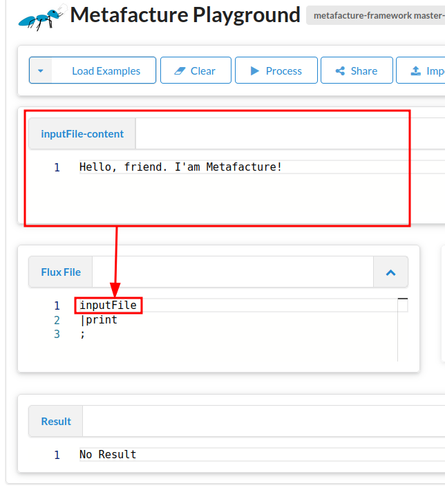

# Lesson 2: Introduction into Metafacture Flux

To perform data processing with Metafacture transformation workflows are configured with **Metafacture Flux**, a [domain-specific scripting language (DSL)](https://en.wikipedia.org/wiki/Domain-specific_language).
With Metafacture Flux we combine different modules for reading, opening, transforming, and writing data sets.

In this lesson we will learn about Metafacture Flux, what Flux workflows are and how to combine different Flux modules to create a workflow in order to process datasets.

## Getting started with the Metafacture Playground

To process data Metafacture can be used with the command line, as JAVA library or you can use the Metafacture Playground.

For this introduction we will start with the Playground since it allows a quick start without additional installing. The [Metafacture Playground](https://metafacture.org/playground) is a web interface to test and share Metafacture workflows. The commandline handling will be subject in [lesson 6](./06_MetafactureCLI.md)

In this tutorial we are going to process *structured information*. We call data structured when it organised in such a way that is easy processable by computers. Literary text documents like *War and Peace* are structured only in words and sentences, but a computer doesn’t know which words are part of the title or which words contain names. We had to tell the computer that. Today we will download a book record in a structured format called JSON and inspect it with Metafacture.

## Flux Workflows

Lets jump to the Playground to learn how to create workflows:


See the window called Flux?

Copy the following short code sample [into the playground](https://metafacture.org/playground/?flux=%22Hello%2C+friend.+I%27am+Metafacture%21%22%0A%7Cprint%0A%3B&active-editor=fix):

```default
"Hello, friend. I'am Metafacture!"
|print
;
```

Great, you have created your first Metafacture Flux Workflow. Congratulations!
Now you can press the `Process`-Button () or press Ctrl+Enter to execute the workflow.

See the result below? It is `Hello, friend. I'am Metafacture!`.

But what have we done here?
We have a short text string `"Hello, friend. I'am Metafacture"`. That is printed with the modul `print`.

A Metafacture Workflow is nothing else as a incoming text string with multiple moduls that do something with the incoming string.
But the workflow does not have to start with a text string but also can be a variable that stands for the text string and needs to be defined before the workflow. As this:

```default
INPUT="Hello, friend. I'am Metafacture!";

INPUT
|print
;
```

Copy this into the window of your playground or just adjust your example.

`INPUT` as a varibale is defined in the first line of the flux. And instead of the text string, the Flux-Workflow starts just with the variable `INPUT` without `"`.

But the result is the same if you process the flux.

Often you want to process data stored in a file.

The playground has an input area called `ìnputFile-content`. In this text area you can insert data that you have usually stored in a file. The variable `inputFile` can be used at the beginning of the workflow and it refers to the input file represented by the `ìnputFile-content`-area.

e.g.




So lets use `inputFile` instead of `INPUT` and copy the value of the text string in the Data field above the Flux.

Data for `inputFile-content`:

`Hello, friend. I'am Metafacture!`

Flux:

```default
inputFile
|print
;
```

Oops... There seems to be unusual output. Its a file path. Why?
Because the variable `inputFile` refers to a file (path).
To read the content of the file we need to handle the incoming file path differently.

(You will learn how to process files on your computer in lesson 06 when we show how to run metafacture on the command line on your computer.)

We need to add two additional Metafacture commands: `open-file` and `as-lines`

Flux:

```default
inputFile
| open-file
| as-lines
| print
;
```

The inputFile is opened as a file (`open-file`) and then processed line by line (`as-line`).
You can see that in this [sample](https://metafacture.org/playground/?flux=inputFile%0A%7Copen-file%0A%7Cas-lines%0A%7Cprint%0A%3B&data=Hello%2C+friend.+I%27am+Metafacture%21).

We usually do not start with any random text strings but with data. So lets play around with some data. 

Let's start with a link: https://openlibrary.org/books/OL2838758M.json

You will see data that look like this:

```JSON
{"publishers": ["Belknap Press of Harvard University Press"], "identifiers": {"librarything": ["321843"], "goodreads": ["2439014"]}, "covers": [413726], "local_id": ["urn:trent:0116301499939", "urn:sfpl:31223009984353", "urn:sfpl:31223011345064", "urn:cst:10017055762"], "lc_classifications": ["JA79 .S44 1984", "HM216 .S44", "JA79.S44 1984"], "key": "/books/OL2838758M", "authors": [{"key": "/authors/OL381196A"}], "ocaid": "ordinaryvices0000shkl", "publish_places": ["Cambridge, Mass"], "subjects": ["Political ethics.", "Liberalism.", "Vices."], "pagination": "268 p. ;", "source_records": ["marc:OpenLibraries-Trent-MARCs/tier5.mrc:4020092:744", "marc:marc_openlibraries_sanfranciscopubliclibrary/sfpl_chq_2018_12_24_run01.mrc:195791766:1651", "ia:ordinaryvices0000shkl", "marc:marc_claremont_school_theology/CSTMARC1_barcode.mrc:137174387:3955", "bwb:9780674641754", "marc:marc_loc_2016/BooksAll.2016.part15.utf8:115755952:680", "marc:marc_claremont_school_theology/CSTMARC1_multibarcode.mrc:137367696:3955", "ia:ordinaryvices0000shkl_a5g0", "marc:marc_columbia/Columbia-extract-20221130-001.mrc:328870555:1311", "marc:harvard_bibliographic_metadata/ab.bib.01.20150123.full.mrc:156768969:815"], "title": "Ordinary vices", "dewey_decimal_class": ["172"], "notes": {"type": "/type/text", "value": "Bibliography: p. 251-260.\nIncludes index."}, "number_of_pages": 268, "languages": [{"key": "/languages/eng"}], "lccn": ["84000531"], "isbn_10": ["0674641752"], "publish_date": "1984", "publish_country": "mau", "by_statement": "Judith N. Shklar.", "works": [{"key": "/works/OL2617047W"}], "type": {"key": "/type/edition"}, "oclc_numbers": ["10348450"], "latest_revision": 16, "revision": 16, "created": {"type": "/type/datetime", "value": "2008-04-01T03:28:50.625462"}, "last_modified": {"type": "/type/datetime", "value": "2024-12-27T16:46:50.181109"}}
``` 

This is data in JSON format. But it seems not very readable.

But all these fields tell something about a publication, a book, with 268 pages and title Ordinary Vices by Judith N. Shklar.

Let's copy the JSON data into our `ìnputFile-content` field. [And run it again](https://metafacture.org/playground/?flux=inputFile%0A%7Copen-file%0A%7Cas-lines%0A%7Cprint%0A%3B&data=%7B%22publishers%22%3A+%5B%22Belknap+Press+of+Harvard+University+Press%22%5D%2C+%22identifiers%22%3A+%7B%22librarything%22%3A+%5B%22321843%22%5D%2C+%22goodreads%22%3A+%5B%222439014%22%5D%7D%2C+%22covers%22%3A+%5B413726%5D%2C+%22local_id%22%3A+%5B%22urn%3Atrent%3A0116301499939%22%2C+%22urn%3Asfpl%3A31223009984353%22%2C+%22urn%3Asfpl%3A31223011345064%22%2C+%22urn%3Acst%3A10017055762%22%5D%2C+%22lc_classifications%22%3A+%5B%22JA79+.S44+1984%22%2C+%22HM216+.S44%22%2C+%22JA79.S44+1984%22%5D%2C+%22key%22%3A+%22/books/OL2838758M%22%2C+%22authors%22%3A+%5B%7B%22key%22%3A+%22/authors/OL381196A%22%7D%5D%2C+%22ocaid%22%3A+%22ordinaryvices0000shkl%22%2C+%22publish_places%22%3A+%5B%22Cambridge%2C+Mass%22%5D%2C+%22subjects%22%3A+%5B%22Political+ethics.%22%2C+%22Liberalism.%22%2C+%22Vices.%22%5D%2C+%22pagination%22%3A+%22268+p.+%3B%22%2C+%22source_records%22%3A+%5B%22marc%3AOpenLibraries-Trent-MARCs/tier5.mrc%3A4020092%3A744%22%2C+%22marc%3Amarc_openlibraries_sanfranciscopubliclibrary/sfpl_chq_2018_12_24_run01.mrc%3A195791766%3A1651%22%2C+%22ia%3Aordinaryvices0000shkl%22%2C+%22marc%3Amarc_claremont_school_theology/CSTMARC1_barcode.mrc%3A137174387%3A3955%22%2C+%22bwb%3A9780674641754%22%2C+%22marc%3Amarc_loc_2016/BooksAll.2016.part15.utf8%3A115755952%3A680%22%2C+%22marc%3Amarc_claremont_school_theology/CSTMARC1_multibarcode.mrc%3A137367696%3A3955%22%2C+%22ia%3Aordinaryvices0000shkl_a5g0%22%2C+%22marc%3Amarc_columbia/Columbia-extract-20221130-001.mrc%3A328870555%3A1311%22%2C+%22marc%3Aharvard_bibliographic_metadata/ab.bib.01.20150123.full.mrc%3A156768969%3A815%22%5D%2C+%22title%22%3A+%22Ordinary+vices%22%2C+%22dewey_decimal_class%22%3A+%5B%22172%22%5D%2C+%22notes%22%3A+%7B%22type%22%3A+%22/type/text%22%2C+%22value%22%3A+%22Bibliography%3A+p.+251-260.\nIncludes+index.%22%7D%2C+%22number_of_pages%22%3A+268%2C+%22languages%22%3A+%5B%7B%22key%22%3A+%22/languages/eng%22%7D%5D%2C+%22lccn%22%3A+%5B%2284000531%22%5D%2C+%22isbn_10%22%3A+%5B%220674641752%22%5D%2C+%22publish_date%22%3A+%221984%22%2C+%22publish_country%22%3A+%22mau%22%2C+%22by_statement%22%3A+%22Judith+N.+Shklar.%22%2C+%22works%22%3A+%5B%7B%22key%22%3A+%22/works/OL2617047W%22%7D%5D%2C+%22type%22%3A+%7B%22key%22%3A+%22/type/edition%22%7D%2C+%22oclc_numbers%22%3A+%5B%2210348450%22%5D%2C+%22latest_revision%22%3A+16%2C+%22revision%22%3A+16%2C+%22created%22%3A+%7B%22type%22%3A+%22/type/datetime%22%2C+%22value%22%3A+%222008-04-01T03%3A28%3A50.625462%22%7D%2C+%22last_modified%22%3A+%7B%22type%22%3A+%22/type/datetime%22%2C+%22value%22%3A+%222024-12-27T16%3A46%3A50.181109%22%7D%7D).

The output in result is the same as the input and it is still not very readable.

Lets turn the one line of JSON data into YAML. YAML is another format for structured information which is a bit easier to read for human eyes.
In order to change the serialization of the data we need to decode the data and then encode the data.

Metafacture has lots of decoder and encoder modules for specific data formats that can be used in an Flux workflow.

Let's try this out. Add the module `decode-json` and `encode-yaml` to your Flux Workflow.

The Flux should now look like this:

Flux:

```default
inputFile
| open-file
| as-lines
| decode-json
| encode-yaml
| print
;
```

[When you process the data](https://metafacture.org/playground/?flux=inputFile%0A%7C+open-file%0A%7C+as-lines%0A%7C+decode-json%0A%7C+encode-yaml%0A%7C+print%0A%3B&data=%7B%22publishers%22%3A+%5B%22Belknap+Press+of+Harvard+University+Press%22%5D%2C+%22identifiers%22%3A+%7B%22librarything%22%3A+%5B%22321843%22%5D%2C+%22goodreads%22%3A+%5B%222439014%22%5D%7D%2C+%22covers%22%3A+%5B413726%5D%2C+%22local_id%22%3A+%5B%22urn%3Atrent%3A0116301499939%22%2C+%22urn%3Asfpl%3A31223009984353%22%2C+%22urn%3Asfpl%3A31223011345064%22%2C+%22urn%3Acst%3A10017055762%22%5D%2C+%22lc_classifications%22%3A+%5B%22JA79+.S44+1984%22%2C+%22HM216+.S44%22%2C+%22JA79.S44+1984%22%5D%2C+%22key%22%3A+%22/books/OL2838758M%22%2C+%22authors%22%3A+%5B%7B%22key%22%3A+%22/authors/OL381196A%22%7D%5D%2C+%22ocaid%22%3A+%22ordinaryvices0000shkl%22%2C+%22publish_places%22%3A+%5B%22Cambridge%2C+Mass%22%5D%2C+%22subjects%22%3A+%5B%22Political+ethics.%22%2C+%22Liberalism.%22%2C+%22Vices.%22%5D%2C+%22pagination%22%3A+%22268+p.+%3B%22%2C+%22source_records%22%3A+%5B%22marc%3AOpenLibraries-Trent-MARCs/tier5.mrc%3A4020092%3A744%22%2C+%22marc%3Amarc_openlibraries_sanfranciscopubliclibrary/sfpl_chq_2018_12_24_run01.mrc%3A195791766%3A1651%22%2C+%22ia%3Aordinaryvices0000shkl%22%2C+%22marc%3Amarc_claremont_school_theology/CSTMARC1_barcode.mrc%3A137174387%3A3955%22%2C+%22bwb%3A9780674641754%22%2C+%22marc%3Amarc_loc_2016/BooksAll.2016.part15.utf8%3A115755952%3A680%22%2C+%22marc%3Amarc_claremont_school_theology/CSTMARC1_multibarcode.mrc%3A137367696%3A3955%22%2C+%22ia%3Aordinaryvices0000shkl_a5g0%22%2C+%22marc%3Amarc_columbia/Columbia-extract-20221130-001.mrc%3A328870555%3A1311%22%2C+%22marc%3Aharvard_bibliographic_metadata/ab.bib.01.20150123.full.mrc%3A156768969%3A815%22%5D%2C+%22title%22%3A+%22Ordinary+vices%22%2C+%22dewey_decimal_class%22%3A+%5B%22172%22%5D%2C+%22notes%22%3A+%7B%22type%22%3A+%22/type/text%22%2C+%22value%22%3A+%22Bibliography%3A+p.+251-260.\nIncludes+index.%22%7D%2C+%22number_of_pages%22%3A+268%2C+%22languages%22%3A+%5B%7B%22key%22%3A+%22/languages/eng%22%7D%5D%2C+%22lccn%22%3A+%5B%2284000531%22%5D%2C+%22isbn_10%22%3A+%5B%220674641752%22%5D%2C+%22publish_date%22%3A+%221984%22%2C+%22publish_country%22%3A+%22mau%22%2C+%22by_statement%22%3A+%22Judith+N.+Shklar.%22%2C+%22works%22%3A+%5B%7B%22key%22%3A+%22/works/OL2617047W%22%7D%5D%2C+%22type%22%3A+%7B%22key%22%3A+%22/type/edition%22%7D%2C+%22oclc_numbers%22%3A+%5B%2210348450%22%5D%2C+%22latest_revision%22%3A+16%2C+%22revision%22%3A+16%2C+%22created%22%3A+%7B%22type%22%3A+%22/type/datetime%22%2C+%22value%22%3A+%222008-04-01T03%3A28%3A50.625462%22%7D%2C+%22last_modified%22%3A+%7B%22type%22%3A+%22/type/datetime%22%2C+%22value%22%3A+%222024-12-27T16%3A46%3A50.181109%22%7D%7D) our book record should now look like this:

```YAML
---
publishers:
- "Belknap Press of Harvard University Press"
identifiers:
  librarything:
  - "321843"
  goodreads:
  - "2439014"
covers:
- "413726"
local_id:
- "urn:trent:0116301499939"
- "urn:sfpl:31223009984353"
- "urn:sfpl:31223011345064"
- "urn:cst:10017055762"
lc_classifications:
- "JA79 .S44 1984"
- "HM216 .S44"
- "JA79.S44 1984"
key: "/books/OL2838758M"
authors:
- key: "/authors/OL381196A"
ocaid: "ordinaryvices0000shkl"
publish_places:
- "Cambridge, Mass"
subjects:
- "Political ethics."
- "Liberalism."
- "Vices."
pagination: "268 p. ;"
source_records:
- "marc:OpenLibraries-Trent-MARCs/tier5.mrc:4020092:744"
- "marc:marc_openlibraries_sanfranciscopubliclibrary/sfpl_chq_2018_12_24_run01.mrc:195791766:1651"
- "ia:ordinaryvices0000shkl"
- "marc:marc_claremont_school_theology/CSTMARC1_barcode.mrc:137174387:3955"
- "bwb:9780674641754"
- "marc:marc_loc_2016/BooksAll.2016.part15.utf8:115755952:680"
- "marc:marc_claremont_school_theology/CSTMARC1_multibarcode.mrc:137367696:3955"
- "ia:ordinaryvices0000shkl_a5g0"
- "marc:marc_columbia/Columbia-extract-20221130-001.mrc:328870555:1311"
- "marc:harvard_bibliographic_metadata/ab.bib.01.20150123.full.mrc:156768969:815"
title: "Ordinary vices"
dewey_decimal_class:
- "172"
notes:
  type: "/type/text"
  value: "Bibliography: p. 251-260.\nIncludes index."
number_of_pages: "268"
languages:
- key: "/languages/eng"
lccn:
- "84000531"
isbn_10:
- "0674641752"
publish_date: "1984"
publish_country: "mau"
by_statement: "Judith N. Shklar."
works:
- key: "/works/OL2617047W"
type:
  key: "/type/edition"
oclc_numbers:
- "10348450"
latest_revision: "16"
revision: "16"
created:
  type: "/type/datetime"
  value: "2008-04-01T03:28:50.625462"
last_modified:
  type: "/type/datetime"
  value: "2024-12-27T16:46:50.181109"
```

This is better readable, right?

But we cannot only open the data we have in our `inputFile-content` field, we also can open stuff on the web:

Instead of using `inputFile` lets read the book data which is provided by the URL from above:

Clear your playground and copy the following Flux workflow:

```default
"https://openlibrary.org/books/OL2838758M.json"
| open-http
| as-lines
| decode-json
| encode-yaml
| print
;
```

The [result in the playground](https://metafacture.org/playground/?flux=%22https%3A//openlibrary.org/books/OL2838758M.json%22%0A%7C+open-http%0A%7C+as-lines%0A%7C+decode-json%0A%7C+encode-yaml%0A%7C+print%0A%3B) should be the same as before but with the module `open-http` you can get the text that is provided via an URL.

Let's take a look what a Flux workflow does. The Flux workflow is combination of different moduls to process incoming structured data. In our example we have different things that we do with these modules:

- First, we have a URL as an input. The URL state the location of the data on the web.
- Second, We tell Metafacture to request the stated url using `open-http`.
- Then how to handle the incoming data: since the JSON is written in one line, we tell Metafacture to regard every new line as a new record with `as-lines`
- Afterwards we tell Metafacture to `decode-json` in order to translate the incoming data as json to the generic internal data model that is called metadata events
- Then Metafacture should serialize the metadata events as YAML with `encode-yaml`
- Finally, we tell MF to `print` everything.

So let's have a small recap of what we done and learned so far.
We played around with the Metafacture Playground.
We learned that Metafacture Flux Workflow is a combination modules with an inital text string or an variable.
We got to know different modules like `open-http`, `as-lines`. `decode-json`, `encode-yaml`, `print`

More modules can be found in the [documentation of available flux commands](https://github.com/metafacture/metafacture-documentation/blob/master/flux-commands.md).

Now take some time and play around a little bit more and use some other modules.

1) Try to change the Flux workflow to output as formeta (a metafacture specific data format) and not as YAML.
2) Configure the style of formeta to multiline.
3) Also try not to print but to write the output to a file called book.xml.

<details>

<summary>Click to see the new workflow</summary>

```default
"https://openlibrary.org/books/OL2838758M.json"
| open-http
| as-lines
| decode-json
| encode-formeta(style="multiline")
| write("book.xml")
;
```
</details>

What you see with the modules `encode-formeta` and `write` is that modules can have further specification in brackets.
These can eiter be a string in `"..."` or attributes that define options as with `style=`.

One last thing you should learn on an abstract level is to grasp the general idea of Metafacture Flux workflows is that they have many different moduls through which the data is flowing.
The most abstract and most common process resemble the following steps:

**→ read → decode → transform → encode → write →**

This process is one that transforms incoming data in a way that is changed at the end.
Each step can be done by one or a combination of multiple modules.
Modules are small tools that do parts of the complete task we want to do.

Each modul demands a certain input and give a certain output. This is called signature.
e.g.:

The fist modul `open-file` expects a string and provides read data (called reader).
This reader data can be passed on to a modul that accepts reader data e.g. in our case `as-lines`.
`as-lines` outputs again a string, that is accepted by the `decode-json` module.

If you have a look at the flux modul/command documentation then you see under signature which data a modul expects and which data it outputs.

The combination of moduls is a Flux workflow.

Each module is separated by a `|` and every workflow ends with a `;`.
Comments can be added with `//`.

See:

```
//input string:
"https://openlibrary.org/books/OL2838758M.json"

// MF Workflow:
| open-http
| as-lines
| decode-json
| encode-formeta(style="multiline")
| write("test.xml")
;
```

---------------

## Exercise

1) [Try to prettyprint the book record in JSON.](https://metafacture.org/playground/?flux=%22https%3A//openlibrary.org/books/OL2838758M.json%22%7C+open-http%0A%7C+as-lines%0A%7C+decode-json%0A%7C+encode-json%28...%29%0A%7C+write%28%22test.xml%22%29%0A%3B)

<details>
<summary>Answer</summary>
Add the option: `prettyPrinting="true"` to the `encode-json`-command.
</details>

1) Have a look at documentation of [`decode-xml`](https://metafacture.org/metafacture-documentation/docs/flux/flux-commands.html#decode-xml) what is different to `decode-json`? And what input does it expect and what output does it create (Hint: signature)?

<details>
<summary>Answer</summary>

The signature of `decode-xml` and `decode-json` is quiet differnet.
`decode-xml`: signature: Reader -> XmlReceiver
`decode-json`: signature: String -> StreamReceiver

Explanation: 
`decode-xml` expects data from Reader output of `open-file` or `open-http`, and creates output that can be transformed by a specific xml `handler`. The xml parser of `decode-xml` works straight with read content of a file or a url.

`decode-json` expects data from output of a string like `as-lines` or `as-records` and creates output that could be transformed by `fix` or encoded with a module like `encode-xml`. For the most decoding you have to specify how (`as-lines` or `as-records`) the incoming data is read.
</details>

2) [Fill out the blanks in the metafacture workflow to transform some local Pica-Data to YAML.](https://metafacture.org/playground/?flux=inputFile%0A%7C+open-file%0A%7C+...%0A%7C+...%0A%7C+...%0A%7C+print%0A%3B&data=001@+%1Fa5%1F01-2%1E001A+%1F01100%3A15-10-94%1E001B+%1F09999%3A12-06-06%1Ft16%3A10%3A17.000%1E001D+%1F09999%3A99-99-99%1E001U+%1F0utf8%1E001X+%1F00%1E002@+%1F0Aag%1E003@+%1F0482147350%1E006U+%1F094%2CP05%1E007E+%1F0U+70.16407%1E007I+%1FSo%1F074057548%1E011@+%1Fa1970%1E017A+%1Farh%1E021A+%1FaDie+@Berufsfreiheit+der+Arbeitnehmer+und+ihre+Ausgestaltung+in+vo%CC%88lkerrechtlichen+Vertra%CC%88gen%1FdEine+Grundrechtsbetrachtg%1E028A+%1F9106884905%1F7Tn3%1FAgnd%1F0106884905%1FaProjahn%1FdHorst+D.%1E033A+%1FpWu%CC%88rzburg%1E034D+%1FaXXXVIII%2C+165+S.%1E034I+%1Fa8%1E037C+%1FaWu%CC%88rzburg%2C+Jur.+F.%2C+Diss.+v.+7.+Aug.+1970%1E%0A001@+%1F01%1Fa5%1E001A+%1F01140%3A08-12-99%1E001B+%1F09999%3A05-01-08%1Ft22%3A57%3A29.000%1E001D+%1F09999%3A99-99-99%1E001U+%1F0utf8%1E001X+%1F00%1E002@+%1F0Aa%1E003@+%1F0958090564%1E004A+%1Ffkart.+%3A+DM+9.70%2C+EUR+4.94%2C+sfr+8.00%2C+S+68.00%1E006U+%1F000%2CB05%2C0285%1E007I+%1FSo%1F076088278%1E011@+%1Fa1999%1E017A+%1Farb%1Fasi%1E019@+%1FaXA-AT%1E021A+%1FaZukunft+Bildung%1FhPolitische+Akademie.+%5BHrsg.+von+Gu%CC%88nther+R.+Burkert-Dottolo+und+Bernhard+Moser%5D%1E028C+%1F9130681849%1F7Tp1%1FVpiz%1FAgnd%1F0130681849%1FE1952%1FaBurkert%1FdGu%CC%88nther+R.%1FBHrsg.%1E033A+%1FpWien%1FnPolit.+Akad.%1E034D+%1Fa79+S.%1E034I+%1Fa24+cm%1E036F+%1Fx299+12%1F9551720077%1FgAdn%1F7Tb1%1FAgnd%1F01040469-7%1FaPolitische+Akademie%1FgWien%1FYPA-Information%1FhPolitische+Akademie%2C+WB%1FpWien%1FJPolitische+Akad.%2C+WB%1Fl99%2C2%1E036F/01+%1Fx12%1F9025841467%1FgAdvz%1Fi2142105-5%1FYAktuelle+Fragen+der+Politik%1FhPolitische+Akademie%1FpWien%1FJPolitische+Akad.+der+O%CC%88VP%1FlBd.+2%1E045E+%1Fa22%1Fd18%1Fm370%1E047A+%1FSFE%1Fata%1E%0A001@+%1Fa5%1F01%1E001A+%1F01140%3A19-02-03%1E001B+%1F09999%3A19-06-11%1Ft01%3A20%3A13.000%1E001D+%1F09999%3A26-04-03%1E001U+%1F0utf8%1E001X+%1F00%1E002@+%1F0Aal%1E003@+%1F0361809549%1E004A+%1FfHlw.%1E006U+%1F000%2CL01%1E006U+%1F004%2CP01-s-41%1E006U+%1F004%2CP01-f-21%1E007G+%1FaDNB%1F0361809549%1E007I+%1FSo%1F072658383%1E007M+%1F04413/0275%1E011@+%1Fa1925%1E019@+%1FaXA-DXDE%1FaXA-DE%1E021A+%1FaHundert+Jahre+Buchdrucker-Innung+Hamburg%1FdWesen+u.+Werden+d.+Vereinigungen+Hamburger+Buchdruckereibesitzer+1825-1925+%3B+Gedenkschrift+zur+100.+Wiederkehr+d.+Gru%CC%88ndungstages%2C+verf.+im+Auftr.+d.+Vorstandes+d.+Buchdrucker-Innung+%28Freie+Innung%29+zu+Hamburg%1FhFriedrich+Voeltzer%1E028A+%1F9101386281%1F7Tp1%1FVpiz%1FAgnd%1F0101386281%1FE1895%1FaVo%CC%88ltzer%1FdFriedrich%1E033A+%1FpHamburg%1FnBuchdrucker-Innung+%28Freie+Innung%29%1E033A+%1FpHamburg%1Fn%5BVerlagsbuchh.+Broschek+%26+Co.%5D%1E034D+%1Fa44+S.%1E034I+%1Fa4%1E%0A001@+%1Fa5%1F01-3%1E001A+%1F01240%3A01-08-95%1E001B+%1F09999%3A24-09-10%1Ft17%3A42%3A20.000%1E001D+%1F09999%3A99-99-99%1E001U+%1F0utf8%1E001X+%1F00%1E002@+%1F0Af%1E003@+%1F0945184085%1E004A+%1F03-89007-044-2%1FfGewebe+%3A+DM+198.00%2C+sfr+198.00%2C+S+1386.00%1E006T+%1F095%2CN35%2C0856%1E006U+%1F095%2CA48%2C1186%1E006U+%1F010%2CP01%1E007I+%1FSo%1F061975997%1E011@+%1Fa1995%1E017A+%1Fara%1E021A+%1Fx213%1F9550711899%1FYNeues+Handbuch+der+Musikwissenschaft%1Fhhrsg.+von+Carl+Dahlhaus.+Fortgef.+von+Hermann+Danuser%1FpLaaber%1FJLaaber-Verl.%1FS48%1F03-89007-030-2%1FgAc%1E021B+%1FlBd.+13.%1FaRegister%1Fhzsgest.+von+Hans-Joachim+Hinrichsen%1E028C+%1F9121445453%1F7Tp3%1FVpiz%1FAgnd%1F0121445453%1FE1952%1FaHinrichsen%1FdHans-Joachim%1E034D+%1FaVIII%2C+408+S.%1E045V+%1F9090001001%1E047A+%1FSFE%1Fagb/fm%1E%0A001@+%1F01-2%1Fa5%1E001A+%1F01239%3A18-08-11%1E001B+%1F09999%3A05-09-11%1Ft23%3A31%3A44.000%1E001D+%1F01240%3A30-08-11%1E001U+%1F0utf8%1E001X+%1F00%1E002@+%1F0Af%1E003@+%1F01014417392%1E004A+%1Ffkart.%1E006U+%1F011%2CA37%1E007G+%1FaDNB%1F01014417392%1E007I+%1FSo%1F0752937239%1E010@+%1Fager%1E011@+%1Fa2011%1E017A+%1Fara%1Fasf%1E021A+%1Fxtr%1F91014809657%1F7Tp3%1FVpiz%1FAgnd%1F01034622773%1FE1958%1FaLu%CC%88beck%1FdMonika%1FYPersonalwirtschaft+mit+DATEV%1FhMonika+Lu%CC%88beck+%3B+Helmut+Lu%CC%88beck%1FpBodenheim%1FpWien%1FJHerdt%1FRXA-DE%1FS650%1FgAc%1E021B+%1FlTrainerbd.%1E032@+%1Fg11%1Fa1.+Ausg.%1E034D+%1Fa129+S.%1E034M+%1FaIll.%1E047A+%1FSFE%1Famar%1E047A+%1FSERW%1Fasal%1E047I+%1Fu%24%1Fc04%1FdDNB%1Fe1%1E)

<details>
<summary>Answer</summary>
[See here](https://metafacture.org/playground/?flux=inputFile%0A%7C+open-file%0A%7C+as-lines%0A%7C+decode-pica%0A%7C+encode-yaml%0A%7C+print%0A%3B&data=001@+%1Fa5%1F01-2%1E001A+%1F01100%3A15-10-94%1E001B+%1F09999%3A12-06-06%1Ft16%3A10%3A17.000%1E001D+%1F09999%3A99-99-99%1E001U+%1F0utf8%1E001X+%1F00%1E002@+%1F0Aag%1E003@+%1F0482147350%1E006U+%1F094%2CP05%1E007E+%1F0U+70.16407%1E007I+%1FSo%1F074057548%1E011@+%1Fa1970%1E017A+%1Farh%1E021A+%1FaDie+@Berufsfreiheit+der+Arbeitnehmer+und+ihre+Ausgestaltung+in+vo%CC%88lkerrechtlichen+Vertra%CC%88gen%1FdEine+Grundrechtsbetrachtg%1E028A+%1F9106884905%1F7Tn3%1FAgnd%1F0106884905%1FaProjahn%1FdHorst+D.%1E033A+%1FpWu%CC%88rzburg%1E034D+%1FaXXXVIII%2C+165+S.%1E034I+%1Fa8%1E037C+%1FaWu%CC%88rzburg%2C+Jur.+F.%2C+Diss.+v.+7.+Aug.+1970%1E%0A001@+%1F01%1Fa5%1E001A+%1F01140%3A08-12-99%1E001B+%1F09999%3A05-01-08%1Ft22%3A57%3A29.000%1E001D+%1F09999%3A99-99-99%1E001U+%1F0utf8%1E001X+%1F00%1E002@+%1F0Aa%1E003@+%1F0958090564%1E004A+%1Ffkart.+%3A+DM+9.70%2C+EUR+4.94%2C+sfr+8.00%2C+S+68.00%1E006U+%1F000%2CB05%2C0285%1E007I+%1FSo%1F076088278%1E011@+%1Fa1999%1E017A+%1Farb%1Fasi%1E019@+%1FaXA-AT%1E021A+%1FaZukunft+Bildung%1FhPolitische+Akademie.+%5BHrsg.+von+Gu%CC%88nther+R.+Burkert-Dottolo+und+Bernhard+Moser%5D%1E028C+%1F9130681849%1F7Tp1%1FVpiz%1FAgnd%1F0130681849%1FE1952%1FaBurkert%1FdGu%CC%88nther+R.%1FBHrsg.%1E033A+%1FpWien%1FnPolit.+Akad.%1E034D+%1Fa79+S.%1E034I+%1Fa24+cm%1E036F+%1Fx299+12%1F9551720077%1FgAdn%1F7Tb1%1FAgnd%1F01040469-7%1FaPolitische+Akademie%1FgWien%1FYPA-Information%1FhPolitische+Akademie%2C+WB%1FpWien%1FJPolitische+Akad.%2C+WB%1Fl99%2C2%1E036F/01+%1Fx12%1F9025841467%1FgAdvz%1Fi2142105-5%1FYAktuelle+Fragen+der+Politik%1FhPolitische+Akademie%1FpWien%1FJPolitische+Akad.+der+O%CC%88VP%1FlBd.+2%1E045E+%1Fa22%1Fd18%1Fm370%1E047A+%1FSFE%1Fata%1E%0A001@+%1Fa5%1F01%1E001A+%1F01140%3A19-02-03%1E001B+%1F09999%3A19-06-11%1Ft01%3A20%3A13.000%1E001D+%1F09999%3A26-04-03%1E001U+%1F0utf8%1E001X+%1F00%1E002@+%1F0Aal%1E003@+%1F0361809549%1E004A+%1FfHlw.%1E006U+%1F000%2CL01%1E006U+%1F004%2CP01-s-41%1E006U+%1F004%2CP01-f-21%1E007G+%1FaDNB%1F0361809549%1E007I+%1FSo%1F072658383%1E007M+%1F04413/0275%1E011@+%1Fa1925%1E019@+%1FaXA-DXDE%1FaXA-DE%1E021A+%1FaHundert+Jahre+Buchdrucker-Innung+Hamburg%1FdWesen+u.+Werden+d.+Vereinigungen+Hamburger+Buchdruckereibesitzer+1825-1925+%3B+Gedenkschrift+zur+100.+Wiederkehr+d.+Gru%CC%88ndungstages%2C+verf.+im+Auftr.+d.+Vorstandes+d.+Buchdrucker-Innung+%28Freie+Innung%29+zu+Hamburg%1FhFriedrich+Voeltzer%1E028A+%1F9101386281%1F7Tp1%1FVpiz%1FAgnd%1F0101386281%1FE1895%1FaVo%CC%88ltzer%1FdFriedrich%1E033A+%1FpHamburg%1FnBuchdrucker-Innung+%28Freie+Innung%29%1E033A+%1FpHamburg%1Fn%5BVerlagsbuchh.+Broschek+%26+Co.%5D%1E034D+%1Fa44+S.%1E034I+%1Fa4%1E%0A001@+%1Fa5%1F01-3%1E001A+%1F01240%3A01-08-95%1E001B+%1F09999%3A24-09-10%1Ft17%3A42%3A20.000%1E001D+%1F09999%3A99-99-99%1E001U+%1F0utf8%1E001X+%1F00%1E002@+%1F0Af%1E003@+%1F0945184085%1E004A+%1F03-89007-044-2%1FfGewebe+%3A+DM+198.00%2C+sfr+198.00%2C+S+1386.00%1E006T+%1F095%2CN35%2C0856%1E006U+%1F095%2CA48%2C1186%1E006U+%1F010%2CP01%1E007I+%1FSo%1F061975997%1E011@+%1Fa1995%1E017A+%1Fara%1E021A+%1Fx213%1F9550711899%1FYNeues+Handbuch+der+Musikwissenschaft%1Fhhrsg.+von+Carl+Dahlhaus.+Fortgef.+von+Hermann+Danuser%1FpLaaber%1FJLaaber-Verl.%1FS48%1F03-89007-030-2%1FgAc%1E021B+%1FlBd.+13.%1FaRegister%1Fhzsgest.+von+Hans-Joachim+Hinrichsen%1E028C+%1F9121445453%1F7Tp3%1FVpiz%1FAgnd%1F0121445453%1FE1952%1FaHinrichsen%1FdHans-Joachim%1E034D+%1FaVIII%2C+408+S.%1E045V+%1F9090001001%1E047A+%1FSFE%1Fagb/fm%1E%0A001@+%1F01-2%1Fa5%1E001A+%1F01239%3A18-08-11%1E001B+%1F09999%3A05-09-11%1Ft23%3A31%3A44.000%1E001D+%1F01240%3A30-08-11%1E001U+%1F0utf8%1E001X+%1F00%1E002@+%1F0Af%1E003@+%1F01014417392%1E004A+%1Ffkart.%1E006U+%1F011%2CA37%1E007G+%1FaDNB%1F01014417392%1E007I+%1FSo%1F0752937239%1E010@+%1Fager%1E011@+%1Fa2011%1E017A+%1Fara%1Fasf%1E021A+%1Fxtr%1F91014809657%1F7Tp3%1FVpiz%1FAgnd%1F01034622773%1FE1958%1FaLu%CC%88beck%1FdMonika%1FYPersonalwirtschaft+mit+DATEV%1FhMonika+Lu%CC%88beck+%3B+Helmut+Lu%CC%88beck%1FpBodenheim%1FpWien%1FJHerdt%1FRXA-DE%1FS650%1FgAc%1E021B+%1FlTrainerbd.%1E032@+%1Fg11%1Fa1.+Ausg.%1E034D+%1Fa129+S.%1E034M+%1FaIll.%1E047A+%1FSFE%1Famar%1E047A+%1FSERW%1Fasal%1E047I+%1Fu%24%1Fc04%1FdDNB%1Fe1%1E)
</details>

3) [Collect MARC-XML from the Web and transform them to JSON](https://metafacture.org/playground/?flux=%22http%3A//lobid.org/download/marcXml-8-records.xml%22%0A%7C+...%0A%7C+...%0A%7C+...%0A%7C+...%0A%7C+print%0A%3B)

<details>
<summary>Answer</summary>
[See here](https://metafacture.org/playground/?flux=%22http%3A//lobid.org/download/marcXml-8-records.xml%22%0A%7C+open-http%0A%7C+decode-xml%0A%7C+handle-marcxml%0A%7C+encode-json%28prettyPrinting%3D%22true%22%29%0A%7C+print%0A%3B)
</details>

As you surely already saw I mentioned transform as one step in a metafacture workflow.

But aside from changing the serialisation we did not play around with transformations yet.
This will be the theme of the next session.

Next lesson: [03 Introduction into Metafacture-Fix](./03_Introduction_into_Metafacture-Fix.md)
