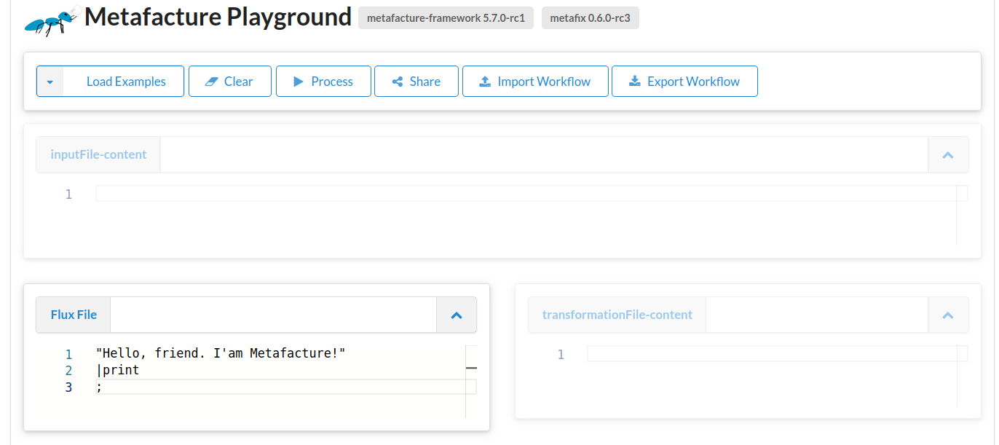
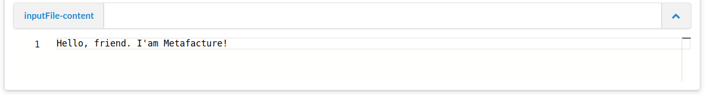
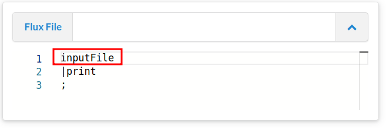

## Introduction into Metafacture Flux?

If you know how to use the command line Metafacture can easily be used. Other ways to use Metafacture are as a JAVA library or with the Playground.

In this lesson we start with the playground. The commandline handling will be subject to a later lesson.


The [Metafacture Playground](https://metafacture.org/playground) is a webinterface to test and share Metafacture. For this introduction we will start with the Playground since it allows a quick start without additional installing. 

In this tutorial we are going to process structured information. We call data structured when it organised in such a way is that it easy processable by computers. Literary text documents like War and Peace are structured only in words and sentences, but a computer doesn’t know which words are part of the title or which words contain names. We had to tell the computer that. Today we will download a weather report in a structured format called JSON and inspect it with the command catmandu.


Lets jump to the Playground to learn how to create workflows:



See the window called Flux? 

Copy this short code sample [into the playground](https://metafacture.org/playground/?flux=%22Hello%2C+friend.+I%27am+Metafacture%21%22%0A%7Cprint%0A%3B&active-editor=fix):

```
"Hello, friend. I'am Metafacture!"
|print
;
```

Great, you have your first Metafacture Flux Workflow. Congratulations.
Now you can press the `Process`-Button or press Ctrl+Enter to execute the workflow.

See the result below? It is `Hello, friend. I'am Metafacture!`.

But what have we done here? 
We have a short text string `"Hello, friend. I'am Metafacture"`. That is printed with the modul `print`.

A Metafacture Workflow is nothing else as a incoming text string with multiple moduls that do something with the incoming string.
But the workflow does not have to start with a text string but also can be a variable that stands for the text string and needs to be defined before the workflow. As this:

```
inputData="Hello, friend. I'am Metafacture!";

inputData
|print
;
```

Copy this into the FLUX window of your playground or just adjust your example.

`INPUT` as a varibale is defined in the first line of the flux. And instead of the text string, the Flux-Workflow starts just with the variable `INPUT` without `"`.

But the result is the same if you process the flux.

Mostly you want to process data in a file.

The playground has a input area called `ìnputFile`-Content that pretends to be a local file. It can be adressed with the variable `inputFile`. In this `ìnputFile`-text area you can insert data samples.

e.g.



In the Playground you can put the variable `inputFile` at the beginning of a MF workflow to process the content of this imaginary file.



it can be used at the beginning
of the workflow and it refers to the input that is written in the Data Window at the top of the playground.


So lets use `inputFile` instead of `INPUT` and copy the value of the text string in the Data field above the Flux.

Data:
`Hello, friend. I'am Metafacture!`

Flux:
```
inputFile
|print
;
```

Höm... There seems to be unusual output. Its a file path. Why?
Because hidden behind the variable `ìnputFile` is a path to a file.
But to read the content of the file. Therefore we need to handle the incoming data differently.

(How to open real files you will learn in one of the session when we learn how to run metafacture on your command line.)

We need to add two additional Metafacture commands: `open-file` and `as-lines`

Flux:
```
inputFile
| open-file
| as-lines
| print
;
```

The inputFile is open as a file and then processed line by line.
You can see that in this [sample](https://metafacture.org/playground/?flux=inputFile%0A%7Copen-file%0A%7Cas-lines%0A%7Cprint%0A%3B&data=Hello%2C+friend.+I%27am+Metafacture%21).

We usually do not start with any random text strings but with data. So lets play around with some data. 

Let's start with a link: https://fcc-weather-api.glitch.me/api/current?lat=50.93414&lon=6.93147


You will see data that look like this:

```JSON
{"coord":{"lon":6.9315,"lat":50.9341},"weather":[{"id":800,"main":"Clear","description":"clear sky","icon":"https://cdn.glitch.com/6e8889e5-7a72-48f0-a061-863548450de5%2F01d.png?1499366022009"}],"base":"stations","main":{"temp":15.82,"feels_like":15.02,"temp_min":14.55,"temp_max":18.03,"pressure":1016,"humidity":60},"visibility":10000,"wind":{"speed":4.63,"deg":340},"clouds":{"all":0},"dt":1654101245,"sys":{"type":2,"id":43069,"country":"DE","sunrise":1654053836,"sunset":1654112194},"timezone":7200,"id":2886242,"name":"Cologne","cod":200}
``` 

This is data in JSON format. But it seems not very readable.

But all these fields tell something about somedays weather in Cologne, Germany. You can recognise in the example above that there the sky is clear and the temperature is 15.82 degrees Celsius).

Let's copy the text from the input into our data field. [And run it again](https://metafacture.org/playground/?flux=inputFile%0A%7Copen-file%0A%7Cas-lines%0A%7Cprint%0A%3B&data=%7B%22coord%22%3A%7B%22lon%22%3A6.9315%2C%22lat%22%3A50.9341%7D%2C%22weather%22%3A%5B%7B%22id%22%3A800%2C%22main%22%3A%22Clear%22%2C%22description%22%3A%22clear+sky%22%2C%22icon%22%3A%22https%3A//cdn.glitch.com/6e8889e5-7a72-48f0-a061-863548450de5%252F01d.png%3F1499366022009%22%7D%5D%2C%22base%22%3A%22stations%22%2C%22main%22%3A%7B%22temp%22%3A15.82%2C%22feels_like%22%3A15.02%2C%22temp_min%22%3A14.55%2C%22temp_max%22%3A18.03%2C%22pressure%22%3A1016%2C%22humidity%22%3A60%7D%2C%22visibility%22%3A10000%2C%22wind%22%3A%7B%22speed%22%3A4.63%2C%22deg%22%3A340%7D%2C%22clouds%22%3A%7B%22all%22%3A0%7D%2C%22dt%22%3A1654101245%2C%22sys%22%3A%7B%22type%22%3A2%2C%22id%22%3A43069%2C%22country%22%3A%22DE%22%2C%22sunrise%22%3A1654053836%2C%22sunset%22%3A1654112194%7D%2C%22timezone%22%3A7200%2C%22id%22%3A2886242%2C%22name%22%3A%22Cologne%22%2C%22cod%22%3A200%7D).
The output in result is the same as the input and it is still not very readable.

So let's transform some stuff. Let us use some other serialization. How about YAML.
With the metafacture you can process this file to make it a bit easier readable by using a small workflow script.
Lets turn the one line of json data into YAML. YAML is another format for structured information which is a bit easier to read for human eyes. 
In order to change the serialization of the data we need to decode the data and then encode the data.

Metafacture has lots of decoder- and encoder-modules that can be used in an FLUX-Workflow.
Let's try this out. Add the module `decode-json` and `encode-yaml` to your Flux Workflow.

The Flux should now look like this:

Flux:
```
inputFile
| open-file
| as-lines
| decode-json
| encode-yaml
| print
;
```

[When you process the data](https://metafacture.org/playground/?flux=inputFile%0A%7C+open-file%0A%7C+as-lines%0A%7C+decode-json%0A%7C+encode-yaml%0A%7C+print%0A%3B&data=%7B%22coord%22%3A%7B%22lon%22%3A6.9315%2C%22lat%22%3A50.9341%7D%2C%22weather%22%3A%5B%7B%22id%22%3A800%2C%22main%22%3A%22Clear%22%2C%22description%22%3A%22clear+sky%22%2C%22icon%22%3A%22https%3A//cdn.glitch.com/6e8889e5-7a72-48f0-a061-863548450de5%252F01d.png%3F1499366022009%22%7D%5D%2C%22base%22%3A%22stations%22%2C%22main%22%3A%7B%22temp%22%3A15.82%2C%22feels_like%22%3A15.02%2C%22temp_min%22%3A14.55%2C%22temp_max%22%3A18.03%2C%22pressure%22%3A1016%2C%22humidity%22%3A60%7D%2C%22visibility%22%3A10000%2C%22wind%22%3A%7B%22speed%22%3A4.63%2C%22deg%22%3A340%7D%2C%22clouds%22%3A%7B%22all%22%3A0%7D%2C%22dt%22%3A1654101245%2C%22sys%22%3A%7B%22type%22%3A2%2C%22id%22%3A43069%2C%22country%22%3A%22DE%22%2C%22sunrise%22%3A1654053836%2C%22sunset%22%3A1654112194%7D%2C%22timezone%22%3A7200%2C%22id%22%3A2886242%2C%22name%22%3A%22Cologne%22%2C%22cod%22%3A200%7D) our weather report should now look like this:

```YAML
---
coord:
  lon: "6.9315"
  lat: "50.9341"
weather:
- id: "800"
  main: "Clear"
  description: "clear sky"
  icon: "https://cdn.glitch.com/6e8889e5-7a72-48f0-a061-863548450de5%2F01d.png?1499366022009"
base: "stations"
main:
  temp: "15.82"
  feels_like: "15.02"
  temp_min: "14.55"
  temp_max: "18.03"
  pressure: "1016"
  humidity: "60"
visibility: "10000"
wind:
  speed: "4.63"
  deg: "340"
clouds:
  all: "0"
dt: "1654101245"
sys:
  type: "2"
  id: "43069"
  country: "DE"
  sunrise: "1654053836"
  sunset: "1654112194"
timezone: "7200"
id: "2886242"
name: "Cologne"
cod: "200"
```

This is better readble right?

But we cannot only open the data we have in our data field. But we also can open stuff on the web:

e.g. instead of using `inputFile` lets read the live weather data which is provided by the URL from above:

Clear your playground and copy the following Flux-Workflow:

```
"https://fcc-weather-api.glitch.me/api/current?lat=50.93414&lon=6.93147"
| open-http
| as-lines
| decode-json
| encode-yaml
| print
;
```

The [result in the playground](https://metafacture.org/playground/?flux=%22https%3A//fcc-weather-api.glitch.me/api/current%3Flat%3D50.93414%26lon%3D6.93147%22%0A%7C+open-http%0A%7C+as-lines%0A%7C+decode-json%0A%7C+encode-yaml%0A%7C+print%0A%3B) should be the same as before but with the module `open-http` you can get the text that is provided via an url.

But lets understand what a Flux Workflow does.
The Flux-Workflow is combination of different moduls to process incoming semi structured data. In our example we have different things that we do with these modules:

First we have a URL.
The URL state the location of the data on the web.
First we tell Metafacture `open-http` to request the stated url.
Then how to handle the data that is incoming: Since the report is writen in one line, we tell Metafacture to regard every new line as a new record with `as-lines`
Afterwards we tell Metafacture to `decode-json` in order to translate the incoming data as json to the generic internal data model that is called metadata events
Lastly Metafacture should serialize the metadata events as YAML with `encode-yaml`
Finally we tell MF to `print` everything.

So let's have a small recap of what we done and learned so far.
We played around with the Metafacture Playground.
We learned that Metafacture Flux Workflow is a combination modules with an inital text string or an variable.
We got to know different modules like `open-http`, `as-lines`. `decode-json`, `encode-yaml`, `print`

More modules can be found in the [documentation of available flux commands](https://github.com/metafacture/metafacture-documentation/blob/master/flux-commands.md).

Now take some time and play around a little bit more and use some other modules.
1) Try to change the Flux workflow to output as formeta (a metafacture specific data format) and not as YAML.
2) Set the style of formeta to multiline.
3) Also try not to print but to write the output and call the file that you write weather.xml.

```
"https://fcc-weather-api.glitch.me/api/current?lat=50.93414&lon=6.93147"
| open-http
| as-lines
| decode-json
| encode-formeta(style="multiline")
| write("test.xml")
;
```

What you see with the module `write` is that modules can have further specification in brackets.
These can eiter be a string in `"..."` or attributes that define options as with `style=`.

One last thing you should learn on an abstract level is to grasp the general idea of Metafacture Flux workflows is that they have many different moduls through which the data is flowing.
The most abstract and most common process resemble the following steps:

→ read → decode → transform → encode → write →

This process is one that Transforms incoming data in a way that is changed at the end.
Each step can be done by one or a combination of multiple modules.
Modules are small tools that do parts of the complete task we want to do.

Each modul demands a certain input and give a certain output. This is called signature.
e.g.:

The fist modul `open-file` expects a string and provides read data (called reader).
This reader data can be passed on to a modul that accepts reader data e.g. in our case `as-lines`
`as-lines` outputs again a string, that is accepted by the `decode-json` module.

If you have a look at the flux modul/command documentation then you see under signature which data a modul expects and which data it outputs.

The combination of moduls is a Flux-Workflow.

Each module is separated by a `|` and every workflow ends with a `;`.
Comments can be added with `//`.

See:
```
//input string:
"https://fcc-weather-api.glitch.me/api/current?lat=50.93414&lon=6.93147"

// MF Workflow:
| open-http
| as-lines
| decode-json
| encode-formeta(style="multiline")
| write("test.xml")
;
```

### Exercise 

Have a look at `decode-xml` what is different to `decode-json` what does it expect?

<details>
<summary>Answer</summary>

The signature of `decode-xml` and `decode-json` is quiet differnet.
`decode-xml`: signature: Reader -> XmlReceiver
`decode-json`: signature: String -> StreamReceiver 

Explanation: 
`decode-xml` expects data from Reader output of `open-file` or `open-http`, and creates output that can be transformed by a specific xml `handler`.

`decode-json` expects data from output of a string like `as-lines` or `as-records` and creates output that could be transformed by `fix` or encoded with a module like `encode-xml`
</details>

Exercise: [Transform some local Pica-Data to YAML.](https://metafacture.org/playground/?flux=inputFile%0A%7C+open-file%0A%7C+...%0A%7C+...%0A%7C+...%0A%7C+print%0A%3B&data=001@+%1Fa5%1F01-2%1E001A+%1F01100%3A15-10-94%1E001B+%1F09999%3A12-06-06%1Ft16%3A10%3A17.000%1E001D+%1F09999%3A99-99-99%1E001U+%1F0utf8%1E001X+%1F00%1E002@+%1F0Aag%1E003@+%1F0482147350%1E006U+%1F094%2CP05%1E007E+%1F0U+70.16407%1E007I+%1FSo%1F074057548%1E011@+%1Fa1970%1E017A+%1Farh%1E021A+%1FaDie+@Berufsfreiheit+der+Arbeitnehmer+und+ihre+Ausgestaltung+in+vo%CC%88lkerrechtlichen+Vertra%CC%88gen%1FdEine+Grundrechtsbetrachtg%1E028A+%1F9106884905%1F7Tn3%1FAgnd%1F0106884905%1FaProjahn%1FdHorst+D.%1E033A+%1FpWu%CC%88rzburg%1E034D+%1FaXXXVIII%2C+165+S.%1E034I+%1Fa8%1E037C+%1FaWu%CC%88rzburg%2C+Jur.+F.%2C+Diss.+v.+7.+Aug.+1970%1E%0A001@+%1F01%1Fa5%1E001A+%1F01140%3A08-12-99%1E001B+%1F09999%3A05-01-08%1Ft22%3A57%3A29.000%1E001D+%1F09999%3A99-99-99%1E001U+%1F0utf8%1E001X+%1F00%1E002@+%1F0Aa%1E003@+%1F0958090564%1E004A+%1Ffkart.+%3A+DM+9.70%2C+EUR+4.94%2C+sfr+8.00%2C+S+68.00%1E006U+%1F000%2CB05%2C0285%1E007I+%1FSo%1F076088278%1E011@+%1Fa1999%1E017A+%1Farb%1Fasi%1E019@+%1FaXA-AT%1E021A+%1FaZukunft+Bildung%1FhPolitische+Akademie.+%5BHrsg.+von+Gu%CC%88nther+R.+Burkert-Dottolo+und+Bernhard+Moser%5D%1E028C+%1F9130681849%1F7Tp1%1FVpiz%1FAgnd%1F0130681849%1FE1952%1FaBurkert%1FdGu%CC%88nther+R.%1FBHrsg.%1E033A+%1FpWien%1FnPolit.+Akad.%1E034D+%1Fa79+S.%1E034I+%1Fa24+cm%1E036F+%1Fx299+12%1F9551720077%1FgAdn%1F7Tb1%1FAgnd%1F01040469-7%1FaPolitische+Akademie%1FgWien%1FYPA-Information%1FhPolitische+Akademie%2C+WB%1FpWien%1FJPolitische+Akad.%2C+WB%1Fl99%2C2%1E036F/01+%1Fx12%1F9025841467%1FgAdvz%1Fi2142105-5%1FYAktuelle+Fragen+der+Politik%1FhPolitische+Akademie%1FpWien%1FJPolitische+Akad.+der+O%CC%88VP%1FlBd.+2%1E045E+%1Fa22%1Fd18%1Fm370%1E047A+%1FSFE%1Fata%1E%0A001@+%1Fa5%1F01%1E001A+%1F01140%3A19-02-03%1E001B+%1F09999%3A19-06-11%1Ft01%3A20%3A13.000%1E001D+%1F09999%3A26-04-03%1E001U+%1F0utf8%1E001X+%1F00%1E002@+%1F0Aal%1E003@+%1F0361809549%1E004A+%1FfHlw.%1E006U+%1F000%2CL01%1E006U+%1F004%2CP01-s-41%1E006U+%1F004%2CP01-f-21%1E007G+%1FaDNB%1F0361809549%1E007I+%1FSo%1F072658383%1E007M+%1F04413/0275%1E011@+%1Fa1925%1E019@+%1FaXA-DXDE%1FaXA-DE%1E021A+%1FaHundert+Jahre+Buchdrucker-Innung+Hamburg%1FdWesen+u.+Werden+d.+Vereinigungen+Hamburger+Buchdruckereibesitzer+1825-1925+%3B+Gedenkschrift+zur+100.+Wiederkehr+d.+Gru%CC%88ndungstages%2C+verf.+im+Auftr.+d.+Vorstandes+d.+Buchdrucker-Innung+%28Freie+Innung%29+zu+Hamburg%1FhFriedrich+Voeltzer%1E028A+%1F9101386281%1F7Tp1%1FVpiz%1FAgnd%1F0101386281%1FE1895%1FaVo%CC%88ltzer%1FdFriedrich%1E033A+%1FpHamburg%1FnBuchdrucker-Innung+%28Freie+Innung%29%1E033A+%1FpHamburg%1Fn%5BVerlagsbuchh.+Broschek+%26+Co.%5D%1E034D+%1Fa44+S.%1E034I+%1Fa4%1E%0A001@+%1Fa5%1F01-3%1E001A+%1F01240%3A01-08-95%1E001B+%1F09999%3A24-09-10%1Ft17%3A42%3A20.000%1E001D+%1F09999%3A99-99-99%1E001U+%1F0utf8%1E001X+%1F00%1E002@+%1F0Af%1E003@+%1F0945184085%1E004A+%1F03-89007-044-2%1FfGewebe+%3A+DM+198.00%2C+sfr+198.00%2C+S+1386.00%1E006T+%1F095%2CN35%2C0856%1E006U+%1F095%2CA48%2C1186%1E006U+%1F010%2CP01%1E007I+%1FSo%1F061975997%1E011@+%1Fa1995%1E017A+%1Fara%1E021A+%1Fx213%1F9550711899%1FYNeues+Handbuch+der+Musikwissenschaft%1Fhhrsg.+von+Carl+Dahlhaus.+Fortgef.+von+Hermann+Danuser%1FpLaaber%1FJLaaber-Verl.%1FS48%1F03-89007-030-2%1FgAc%1E021B+%1FlBd.+13.%1FaRegister%1Fhzsgest.+von+Hans-Joachim+Hinrichsen%1E028C+%1F9121445453%1F7Tp3%1FVpiz%1FAgnd%1F0121445453%1FE1952%1FaHinrichsen%1FdHans-Joachim%1E034D+%1FaVIII%2C+408+S.%1E045V+%1F9090001001%1E047A+%1FSFE%1Fagb/fm%1E%0A001@+%1F01-2%1Fa5%1E001A+%1F01239%3A18-08-11%1E001B+%1F09999%3A05-09-11%1Ft23%3A31%3A44.000%1E001D+%1F01240%3A30-08-11%1E001U+%1F0utf8%1E001X+%1F00%1E002@+%1F0Af%1E003@+%1F01014417392%1E004A+%1Ffkart.%1E006U+%1F011%2CA37%1E007G+%1FaDNB%1F01014417392%1E007I+%1FSo%1F0752937239%1E010@+%1Fager%1E011@+%1Fa2011%1E017A+%1Fara%1Fasf%1E021A+%1Fxtr%1F91014809657%1F7Tp3%1FVpiz%1FAgnd%1F01034622773%1FE1958%1FaLu%CC%88beck%1FdMonika%1FYPersonalwirtschaft+mit+DATEV%1FhMonika+Lu%CC%88beck+%3B+Helmut+Lu%CC%88beck%1FpBodenheim%1FpWien%1FJHerdt%1FRXA-DE%1FS650%1FgAc%1E021B+%1FlTrainerbd.%1E032@+%1Fg11%1Fa1.+Ausg.%1E034D+%1Fa129+S.%1E034M+%1FaIll.%1E047A+%1FSFE%1Famar%1E047A+%1FSERW%1Fasal%1E047I+%1Fu%24%1Fc04%1FdDNB%1Fe1%1E)

<details>
<summary>Answer</summary>
[See here](https://metafacture.org/playground/?flux=inputFile%0A%7C+open-file%0A%7C+as-lines%0A%7C+decode-pica%0A%7C+encode-yaml%0A%7C+print%0A%3B&data=001@+%1Fa5%1F01-2%1E001A+%1F01100%3A15-10-94%1E001B+%1F09999%3A12-06-06%1Ft16%3A10%3A17.000%1E001D+%1F09999%3A99-99-99%1E001U+%1F0utf8%1E001X+%1F00%1E002@+%1F0Aag%1E003@+%1F0482147350%1E006U+%1F094%2CP05%1E007E+%1F0U+70.16407%1E007I+%1FSo%1F074057548%1E011@+%1Fa1970%1E017A+%1Farh%1E021A+%1FaDie+@Berufsfreiheit+der+Arbeitnehmer+und+ihre+Ausgestaltung+in+vo%CC%88lkerrechtlichen+Vertra%CC%88gen%1FdEine+Grundrechtsbetrachtg%1E028A+%1F9106884905%1F7Tn3%1FAgnd%1F0106884905%1FaProjahn%1FdHorst+D.%1E033A+%1FpWu%CC%88rzburg%1E034D+%1FaXXXVIII%2C+165+S.%1E034I+%1Fa8%1E037C+%1FaWu%CC%88rzburg%2C+Jur.+F.%2C+Diss.+v.+7.+Aug.+1970%1E%0A001@+%1F01%1Fa5%1E001A+%1F01140%3A08-12-99%1E001B+%1F09999%3A05-01-08%1Ft22%3A57%3A29.000%1E001D+%1F09999%3A99-99-99%1E001U+%1F0utf8%1E001X+%1F00%1E002@+%1F0Aa%1E003@+%1F0958090564%1E004A+%1Ffkart.+%3A+DM+9.70%2C+EUR+4.94%2C+sfr+8.00%2C+S+68.00%1E006U+%1F000%2CB05%2C0285%1E007I+%1FSo%1F076088278%1E011@+%1Fa1999%1E017A+%1Farb%1Fasi%1E019@+%1FaXA-AT%1E021A+%1FaZukunft+Bildung%1FhPolitische+Akademie.+%5BHrsg.+von+Gu%CC%88nther+R.+Burkert-Dottolo+und+Bernhard+Moser%5D%1E028C+%1F9130681849%1F7Tp1%1FVpiz%1FAgnd%1F0130681849%1FE1952%1FaBurkert%1FdGu%CC%88nther+R.%1FBHrsg.%1E033A+%1FpWien%1FnPolit.+Akad.%1E034D+%1Fa79+S.%1E034I+%1Fa24+cm%1E036F+%1Fx299+12%1F9551720077%1FgAdn%1F7Tb1%1FAgnd%1F01040469-7%1FaPolitische+Akademie%1FgWien%1FYPA-Information%1FhPolitische+Akademie%2C+WB%1FpWien%1FJPolitische+Akad.%2C+WB%1Fl99%2C2%1E036F/01+%1Fx12%1F9025841467%1FgAdvz%1Fi2142105-5%1FYAktuelle+Fragen+der+Politik%1FhPolitische+Akademie%1FpWien%1FJPolitische+Akad.+der+O%CC%88VP%1FlBd.+2%1E045E+%1Fa22%1Fd18%1Fm370%1E047A+%1FSFE%1Fata%1E%0A001@+%1Fa5%1F01%1E001A+%1F01140%3A19-02-03%1E001B+%1F09999%3A19-06-11%1Ft01%3A20%3A13.000%1E001D+%1F09999%3A26-04-03%1E001U+%1F0utf8%1E001X+%1F00%1E002@+%1F0Aal%1E003@+%1F0361809549%1E004A+%1FfHlw.%1E006U+%1F000%2CL01%1E006U+%1F004%2CP01-s-41%1E006U+%1F004%2CP01-f-21%1E007G+%1FaDNB%1F0361809549%1E007I+%1FSo%1F072658383%1E007M+%1F04413/0275%1E011@+%1Fa1925%1E019@+%1FaXA-DXDE%1FaXA-DE%1E021A+%1FaHundert+Jahre+Buchdrucker-Innung+Hamburg%1FdWesen+u.+Werden+d.+Vereinigungen+Hamburger+Buchdruckereibesitzer+1825-1925+%3B+Gedenkschrift+zur+100.+Wiederkehr+d.+Gru%CC%88ndungstages%2C+verf.+im+Auftr.+d.+Vorstandes+d.+Buchdrucker-Innung+%28Freie+Innung%29+zu+Hamburg%1FhFriedrich+Voeltzer%1E028A+%1F9101386281%1F7Tp1%1FVpiz%1FAgnd%1F0101386281%1FE1895%1FaVo%CC%88ltzer%1FdFriedrich%1E033A+%1FpHamburg%1FnBuchdrucker-Innung+%28Freie+Innung%29%1E033A+%1FpHamburg%1Fn%5BVerlagsbuchh.+Broschek+%26+Co.%5D%1E034D+%1Fa44+S.%1E034I+%1Fa4%1E%0A001@+%1Fa5%1F01-3%1E001A+%1F01240%3A01-08-95%1E001B+%1F09999%3A24-09-10%1Ft17%3A42%3A20.000%1E001D+%1F09999%3A99-99-99%1E001U+%1F0utf8%1E001X+%1F00%1E002@+%1F0Af%1E003@+%1F0945184085%1E004A+%1F03-89007-044-2%1FfGewebe+%3A+DM+198.00%2C+sfr+198.00%2C+S+1386.00%1E006T+%1F095%2CN35%2C0856%1E006U+%1F095%2CA48%2C1186%1E006U+%1F010%2CP01%1E007I+%1FSo%1F061975997%1E011@+%1Fa1995%1E017A+%1Fara%1E021A+%1Fx213%1F9550711899%1FYNeues+Handbuch+der+Musikwissenschaft%1Fhhrsg.+von+Carl+Dahlhaus.+Fortgef.+von+Hermann+Danuser%1FpLaaber%1FJLaaber-Verl.%1FS48%1F03-89007-030-2%1FgAc%1E021B+%1FlBd.+13.%1FaRegister%1Fhzsgest.+von+Hans-Joachim+Hinrichsen%1E028C+%1F9121445453%1F7Tp3%1FVpiz%1FAgnd%1F0121445453%1FE1952%1FaHinrichsen%1FdHans-Joachim%1E034D+%1FaVIII%2C+408+S.%1E045V+%1F9090001001%1E047A+%1FSFE%1Fagb/fm%1E%0A001@+%1F01-2%1Fa5%1E001A+%1F01239%3A18-08-11%1E001B+%1F09999%3A05-09-11%1Ft23%3A31%3A44.000%1E001D+%1F01240%3A30-08-11%1E001U+%1F0utf8%1E001X+%1F00%1E002@+%1F0Af%1E003@+%1F01014417392%1E004A+%1Ffkart.%1E006U+%1F011%2CA37%1E007G+%1FaDNB%1F01014417392%1E007I+%1FSo%1F0752937239%1E010@+%1Fager%1E011@+%1Fa2011%1E017A+%1Fara%1Fasf%1E021A+%1Fxtr%1F91014809657%1F7Tp3%1FVpiz%1FAgnd%1F01034622773%1FE1958%1FaLu%CC%88beck%1FdMonika%1FYPersonalwirtschaft+mit+DATEV%1FhMonika+Lu%CC%88beck+%3B+Helmut+Lu%CC%88beck%1FpBodenheim%1FpWien%1FJHerdt%1FRXA-DE%1FS650%1FgAc%1E021B+%1FlTrainerbd.%1E032@+%1Fg11%1Fa1.+Ausg.%1E034D+%1Fa129+S.%1E034M+%1FaIll.%1E047A+%1FSFE%1Famar%1E047A+%1FSERW%1Fasal%1E047I+%1Fu%24%1Fc04%1FdDNB%1Fe1%1E)
</details>

Exercise: [Transform some local Pica-Data to YAML.](https://metafacture.org/playground/?flux=inputFile%0A%7C+open-file%0A%7C+...%0A%7C+...%0A%7C+...%0A%7C+print%0A%3B&data=001@+%1Fa5%1F01-2%1E001A+%1F01100%3A15-10-94%1E001B+%1F09999%3A12-06-06%1Ft16%3A10%3A17.000%1E001D+%1F09999%3A99-99-99%1E001U+%1F0utf8%1E001X+%1F00%1E002@+%1F0Aag%1E003@+%1F0482147350%1E006U+%1F094%2CP05%1E007E+%1F0U+70.16407%1E007I+%1FSo%1F074057548%1E011@+%1Fa1970%1E017A+%1Farh%1E021A+%1FaDie+@Berufsfreiheit+der+Arbeitnehmer+und+ihre+Ausgestaltung+in+vo%CC%88lkerrechtlichen+Vertra%CC%88gen%1FdEine+Grundrechtsbetrachtg%1E028A+%1F9106884905%1F7Tn3%1FAgnd%1F0106884905%1FaProjahn%1FdHorst+D.%1E033A+%1FpWu%CC%88rzburg%1E034D+%1FaXXXVIII%2C+165+S.%1E034I+%1Fa8%1E037C+%1FaWu%CC%88rzburg%2C+Jur.+F.%2C+Diss.+v.+7.+Aug.+1970%1E%0A001@+%1F01%1Fa5%1E001A+%1F01140%3A08-12-99%1E001B+%1F09999%3A05-01-08%1Ft22%3A57%3A29.000%1E001D+%1F09999%3A99-99-99%1E001U+%1F0utf8%1E001X+%1F00%1E002@+%1F0Aa%1E003@+%1F0958090564%1E004A+%1Ffkart.+%3A+DM+9.70%2C+EUR+4.94%2C+sfr+8.00%2C+S+68.00%1E006U+%1F000%2CB05%2C0285%1E007I+%1FSo%1F076088278%1E011@+%1Fa1999%1E017A+%1Farb%1Fasi%1E019@+%1FaXA-AT%1E021A+%1FaZukunft+Bildung%1FhPolitische+Akademie.+%5BHrsg.+von+Gu%CC%88nther+R.+Burkert-Dottolo+und+Bernhard+Moser%5D%1E028C+%1F9130681849%1F7Tp1%1FVpiz%1FAgnd%1F0130681849%1FE1952%1FaBurkert%1FdGu%CC%88nther+R.%1FBHrsg.%1E033A+%1FpWien%1FnPolit.+Akad.%1E034D+%1Fa79+S.%1E034I+%1Fa24+cm%1E036F+%1Fx299+12%1F9551720077%1FgAdn%1F7Tb1%1FAgnd%1F01040469-7%1FaPolitische+Akademie%1FgWien%1FYPA-Information%1FhPolitische+Akademie%2C+WB%1FpWien%1FJPolitische+Akad.%2C+WB%1Fl99%2C2%1E036F/01+%1Fx12%1F9025841467%1FgAdvz%1Fi2142105-5%1FYAktuelle+Fragen+der+Politik%1FhPolitische+Akademie%1FpWien%1FJPolitische+Akad.+der+O%CC%88VP%1FlBd.+2%1E045E+%1Fa22%1Fd18%1Fm370%1E047A+%1FSFE%1Fata%1E%0A001@+%1Fa5%1F01%1E001A+%1F01140%3A19-02-03%1E001B+%1F09999%3A19-06-11%1Ft01%3A20%3A13.000%1E001D+%1F09999%3A26-04-03%1E001U+%1F0utf8%1E001X+%1F00%1E002@+%1F0Aal%1E003@+%1F0361809549%1E004A+%1FfHlw.%1E006U+%1F000%2CL01%1E006U+%1F004%2CP01-s-41%1E006U+%1F004%2CP01-f-21%1E007G+%1FaDNB%1F0361809549%1E007I+%1FSo%1F072658383%1E007M+%1F04413/0275%1E011@+%1Fa1925%1E019@+%1FaXA-DXDE%1FaXA-DE%1E021A+%1FaHundert+Jahre+Buchdrucker-Innung+Hamburg%1FdWesen+u.+Werden+d.+Vereinigungen+Hamburger+Buchdruckereibesitzer+1825-1925+%3B+Gedenkschrift+zur+100.+Wiederkehr+d.+Gru%CC%88ndungstages%2C+verf.+im+Auftr.+d.+Vorstandes+d.+Buchdrucker-Innung+%28Freie+Innung%29+zu+Hamburg%1FhFriedrich+Voeltzer%1E028A+%1F9101386281%1F7Tp1%1FVpiz%1FAgnd%1F0101386281%1FE1895%1FaVo%CC%88ltzer%1FdFriedrich%1E033A+%1FpHamburg%1FnBuchdrucker-Innung+%28Freie+Innung%29%1E033A+%1FpHamburg%1Fn%5BVerlagsbuchh.+Broschek+%26+Co.%5D%1E034D+%1Fa44+S.%1E034I+%1Fa4%1E%0A001@+%1Fa5%1F01-3%1E001A+%1F01240%3A01-08-95%1E001B+%1F09999%3A24-09-10%1Ft17%3A42%3A20.000%1E001D+%1F09999%3A99-99-99%1E001U+%1F0utf8%1E001X+%1F00%1E002@+%1F0Af%1E003@+%1F0945184085%1E004A+%1F03-89007-044-2%1FfGewebe+%3A+DM+198.00%2C+sfr+198.00%2C+S+1386.00%1E006T+%1F095%2CN35%2C0856%1E006U+%1F095%2CA48%2C1186%1E006U+%1F010%2CP01%1E007I+%1FSo%1F061975997%1E011@+%1Fa1995%1E017A+%1Fara%1E021A+%1Fx213%1F9550711899%1FYNeues+Handbuch+der+Musikwissenschaft%1Fhhrsg.+von+Carl+Dahlhaus.+Fortgef.+von+Hermann+Danuser%1FpLaaber%1FJLaaber-Verl.%1FS48%1F03-89007-030-2%1FgAc%1E021B+%1FlBd.+13.%1FaRegister%1Fhzsgest.+von+Hans-Joachim+Hinrichsen%1E028C+%1F9121445453%1F7Tp3%1FVpiz%1FAgnd%1F0121445453%1FE1952%1FaHinrichsen%1FdHans-Joachim%1E034D+%1FaVIII%2C+408+S.%1E045V+%1F9090001001%1E047A+%1FSFE%1Fagb/fm%1E%0A001@+%1F01-2%1Fa5%1E001A+%1F01239%3A18-08-11%1E001B+%1F09999%3A05-09-11%1Ft23%3A31%3A44.000%1E001D+%1F01240%3A30-08-11%1E001U+%1F0utf8%1E001X+%1F00%1E002@+%1F0Af%1E003@+%1F01014417392%1E004A+%1Ffkart.%1E006U+%1F011%2CA37%1E007G+%1FaDNB%1F01014417392%1E007I+%1FSo%1F0752937239%1E010@+%1Fager%1E011@+%1Fa2011%1E017A+%1Fara%1Fasf%1E021A+%1Fxtr%1F91014809657%1F7Tp3%1FVpiz%1FAgnd%1F01034622773%1FE1958%1FaLu%CC%88beck%1FdMonika%1FYPersonalwirtschaft+mit+DATEV%1FhMonika+Lu%CC%88beck+%3B+Helmut+Lu%CC%88beck%1FpBodenheim%1FpWien%1FJHerdt%1FRXA-DE%1FS650%1FgAc%1E021B+%1FlTrainerbd.%1E032@+%1Fg11%1Fa1.+Ausg.%1E034D+%1Fa129+S.%1E034M+%1FaIll.%1E047A+%1FSFE%1Famar%1E047A+%1FSERW%1Fasal%1E047I+%1Fu%24%1Fc04%1FdDNB%1Fe1%1E)


Exercise 5: [Collect MARC-XML from the WEB and transform them to JSON](https://metafacture.org/playground/?flux=%22http%3A//lobid.org/download/marcXml-8-records.xml%22%0A%7C+...%0A%7C+...%0A%7C+...%0A%7C+...%0A%7C+print%0A%3B)

<details>
<summary>Answer</summary>
[See here](https://metafacture.org/playground/?flux=%22http%3A//lobid.org/download/marcXml-8-records.xml%22%0A%7C+open-http%0A%7C+decode-xml%0A%7C+handle-marcxml%0A%7C+encode-json%28prettyPrinting%3D%22true%22%29%0A%7C+print%0A%3B)
</details>

As you surely already saw is that I mentioned transform as one step. We did not play around with transformations yet.
This will be the theme of the next session.

Next lesson: [03 Introduction into Metafacture-Fix](./03_Introduction_into_Metafacture-Fix.md)
