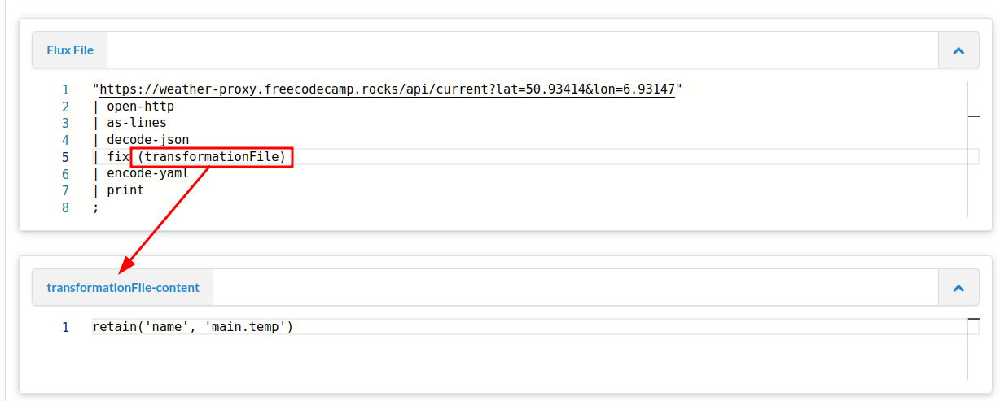

# Lesson 3: Introduction into Metafacture Fix

In the last session we learned about Flux moduls.
Flux moduls can do a lot of things. They configure the "high-level" transformation pipeline.

But the main transformation of incoming data at record, elemenet and value level is usually done by the transformation moduls [Fix](https://metafacture.github.io/metafacture-documentation/docs/flux/flux-commands.html#fix) or [Morph](https://metafacture.github.io/metafacture-documentation/docs/flux/flux-commands.html#morph) as one step in the pipeline.

By transformation we mean things like:

* Manipulating element names and element values
* Change hierachies and structures of records
* Lookup values in concordance list

But not changing serialization that is part of encoding and decoding.

In this tutorial we focus on [Fix](https://metafacture.github.io/metafacture-documentation/docs/flux/flux-commands.html#fix). If you want to learn about Morph have a look [at this presentation](https://slides.lobid.org/metafacture-2020/#/) and the [great documentation by Swiss Bib](https://sschuepbach.github.io/metamorph-hacks/).


## Metafacture Fix and Fix Functions

So let's dive into Metafacture Fix and get back to the [Playground](https://metafacture.org/playground/?flux=%22https%3A//openlibrary.org/books/OL2838758M.json%22%0A%7C+open-http%0A%7C+as-lines%0A%7C+decode-json%0A%7C+encode-yaml%0A%7C+print%0A%3B).

Clear it if needed and paste the following Flux in the Flux-File area.

```default
"https://openlibrary.org/books/OL2838758M.json"
| open-http
| as-lines
| decode-json
| fix ("retain('title')")
| encode-yaml
| print
;
```

You should end up with something like:

```YAML
---
title: "Ordinary vices"
```

The `fix` module in Metafacture is used to manipulate the input data filtering fields we would like to see. Only one fix-function was used: `retain`, which throws away all the data from the input except the stated `"title"` field. Normally all incoming data is passed through, unless it is somehow manipulated or a `retain` function is used.

HINT: As long as you embedd the fix functions in the Flux Workflow, you have to use double quotes to fence the fix functions,
and single quotes in the fix functions. As we did here: `fix ("retain('title')")`

Now let us additionally keep the info that is given in the element `"publish_date"` and the subfield `"key"` in `'type'` by adding `'publish_date', 'type.key'` to `retain`:

```default
"https://openlibrary.org/books/OL2838758M.json"
| open-http
| as-lines
| decode-json
| fix ("retain('title', 'publish_date', 'notes.value', 'type.key')")
| encode-yaml
| print
;
```

You should now see something like this:

```YAML
---
title: "Ordinary vices"
publish_date: "1984"
notes:
  value: "Bibliography: p. 251-260.\nIncludes index."

```

When manipulating data you often need to create many fixes to process a data file in the format and structure you need. With a text editor you can write all fix functions in a singe separate Fix file.

The playground has an transformationFile-content area that can be used as if the Fix is in a separate file.
In the playground we use the variable `transformationFile` to adress the Fix file in the playground.

Like this.



Fix:

```PERL
retain("title", "publish_date", "notes.value", "type.key")
```

Using a separate Fix file is recommended if you need to write many Fix functions. It will keep the Flux workflow clear and legible.

To add more fixes we can again edit the Fix file.
Lets add these lines in front of the retain function:

```
move_field("type.key", "pub_type")
```

Also change the `retain` function so that you keep the new element `"pub_type"` instead of the not existing nested `"key"` element.

```
move_field("type.key","pub_type")
retain("title", "publish_date",  "notes.value", "pub_type")
```

The output should be something like this:

```YAML
---
title: "Ordinary vices"
publish_date: "1984"
pub_type: "/type/edition"
notes:
  value: "Bibliography: p. 251-260.\nIncludes index."
```

With `move_field` we moved and renamed an existing element.
As next step add the following function before the `retain` function.

```
replace_all("pub_type","/type/","")
```

If you execute your last workflow with the "Process" button again, you should now see as ouput:

```YAML
---
title: "Ordinary vices"
publish_date: "1984"
pub_type: "edition"
notes:
  value: "Bibliography: p. 251-260.\nIncludes index."
```

We cleaned up the value of `"pub_type"` element for better readability.

[See the example in the playground.](https://metafacture.org/playground/?flux=%22https%3A//openlibrary.org/books/OL2838758M.json%22%0A%7C+open-http%0A%7C+as-lines%0A%7C+decode-json%0A%7C+fix+%28transformationFile%29%0A%7C+encode-yaml%0A%7C+print%0A%3B&transformation=move_field%28%22type.key%22%2C%22pub_type%22%29%0Areplace_all%28%22pub_type%22%2C%22/type/%22%2C%22%22%29%0Aretain%28%22title%22%2C+%22publish_date%22%2C+%22pub_type%22%29)

Metafacture contains many Fix functions to manipulate data. Also there are many Flux commands/modules that can be used.

Check the documentation to get a complete list of [Flux commands](https://metafacture.github.io/metafacture-documentation/docs/flux/flux-commands.html) and [Fix functions](https://metafacture.github.io/metafacture-documentation/docs/fix/Fix-functions.html). This post only presented a short introduction into Metafacture. In the next posts we will go deeper into its capabilities.

Besides Fix functions you can also add as many comments and linebreaks as you want to a Fix.

Adding comments will save you a lot of time and effort when you look at your code in the future.

Comments in Fix start with a hash mark `#`, while in Flux they start with `//`.

Example:

```PERL
# Make type.key a top level element.
move_field("type.key","pub_type")

# Clean the value of `pub_type`
replace_all("pub_type","/type/","")

# Keep only specific elements.
retain("title", "publish_date", "pub_type")
```

## Excercise

1) [Additionally keep the `"by_statement"`. Hint: Add something to `retain`](https://metafacture.org/playground/?flux=%22https%3A//openlibrary.org/books/OL2838758M.json%22%0A%7C+open-http%0A%7C+as-lines%0A%7C+decode-json%0A%7C+fix+%28transformationFile%29%0A%7C+encode-yaml%0A%7C+print%0A%3B&transformation=move_field%28%22type.key%22%2C%22pub_type%22%29%0Areplace_all%28%22pub_type%22%2C%22/type/%22%2C%22%22%29%0Aretain%28%22title%22%2C+%22publish_date%22%2C+%22pub_type%22%29)

2) [Add a field with todays date called `"map_date"`.](https://metafacture.org/playground/?flux=%22https%3A//openlibrary.org/books/OL2838758M.json%22%0A%7C+open-http%0A%7C+as-lines%0A%7C+decode-json%0A%7C+fix+%28transformationFile%29%0A%7C+encode-yaml%0A%7C+print%0A%3B&transformation=move_field%28%22type.key%22%2C%22pub_type%22%29%0Areplace_all%28%22pub_type%22%2C%22/type/%22%2C%22%22%29%0A...%28%22mape_date%22%2C%22...%22%29%0Aretain%28%22title%22%2C+%22publish_date%22%2C+%22by_statement%22%2C+%22pub_type%22%29)

Have a look at the fix functions: https://metafacture.org/metafacture-documentation/docs/fix/Fix-functions.html (Hint: you could use `add_field` or `timestamp`. And don't forget to add the new element to `retain`)


<details>
<summary>Answer</summary>
<a href="https://metafacture.org/playground/?flux=%22https%3A//openlibrary.org/books/OL2838758M.json%22%0A%7C+open-http%0A%7C+as-lines%0A%7C+decode-json%0A%7C+fix+%28transformationFile%29%0A%7C+encode-yaml%0A%7C+print%0A%3B&transformation=move_field%28%22type.key%22%2C%22pub_type%22%29%0Areplace_all%28%22pub_type%22%2C%22/type/%22%2C%22%22%29%0Aadd_field%28%22map_date%22%2C%222025-11-11%22%29%0Aretain%28%22title%22%2C+%22publish_date%22%2C+%22by_statement%22%2C+%22pub_type%22%2C+%22map_date%22%29">See here</a>
or <a href="https://metafacture.org/playground/?flux=%22https%3A//openlibrary.org/books/OL2838758M.json%22%0A%7C+open-http%0A%7C+as-lines%0A%7C+decode-json%0A%7C+fix+%28transformationFile%29%0A%7C+encode-yaml%0A%7C+print%0A%3B&transformation=move_field%28%22type.key%22%2C%22pub_type%22%29%0Areplace_all%28%22pub_type%22%2C%22/type/%22%2C%22%22%29%0Atimestamp%28%22map_date%22%2Cformat%3A%22yyyy-MM-dd%27T%27HH%3Amm%3Ass%22%2C+timezone%3A%22Europe/Berlin%22%29%0Aretain%28%22title%22%2C+%22publish_date%22%2C+%22by_statement%22%2C+%22pub_type%22%2C+%22map_date%22%29">use timestamp</a>
</details>

Next lesson: [04 Fix Path](./04_Fix-Path.md)
