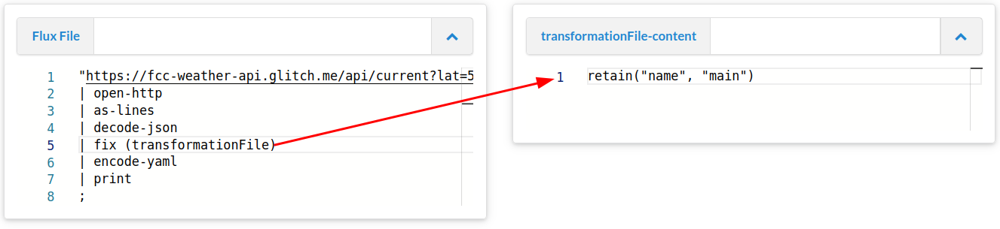

## Introduction into Metafacture Fix

In the last session we learned about FLUX-Moduls.
Flux-Moduls can do a lot of things. They configure the the "high-level" transformation pipeline.

But the main transformation of incoming data at record-, elemenet- and value-level is usually done by the transformation moduls: `fix` or `morph` as one step in the pipeline.

What do we mean when we talk about transformation:
e.g.
 * Manipulating element-names and element-values
 * Change hierachies and structures of records
 * Lookup values in concordance list. 

But not changing serialization that is part of encoding and decoding.

In this tutorial I focus on Fix. If you want to learn about Morph have a look at https://slides.lobid.org/metafacture-2020/#/

So dive into Metafacture Fix. Lets get back to the [Playground](https://metafacture.org/playground/?flux=%22https%3A//fcc-weather-api.glitch.me/api/current%3Flat%3D50.93414%26lon%3D6.93147%22%0A%7C+open-http%0A%7C+as-lines%0A%7C+decode-json%0A%7C+fix+%28%22retain%28%27name%27%29%22%29%0A%7C+encode-yaml%0A%7C+print%0A%3B). Clear it if needed and paste the following Flux in the Flux-File area.

```
"https://fcc-weather-api.glitch.me/api/current?lat=50.93414&lon=6.93147"
| open-http
| as-lines
| decode-json
| fix ("retain('name')")
| encode-yaml
| print;
```

You should end up with something like:

```
---
name: Cologne
...
```

The `fix` module in Metafacture is used to manipulate the input data filtering fields we would like to see. Only one fix-function was used: `retain`, which throws away all the data from the input except the ‘name’ field.

> TODO: This should be changed when subfields can be retained.

Also add the info that is written in `main`


```
"https://fcc-weather-api.glitch.me/api/current?lat=50.93414&lon=6.93147"
| open-http
| as-lines
| decode-json
| fix ("retain('name', 'main')")
| encode-yaml
| print;
```

You should now see something like this:

```
---
main:
  temp: "15.99"
  feels_like: "15.21"
  temp_min: "14.55"
  temp_max: "16.99"
  pressure: "1017"
  humidity: "60"
name: "Cologne"
```

When manipulating data you often need to create many fixes to process a data file in the format you need. With a text editor you can write all fix functions in a singe separate fix-file.

In your playground move the fix-function to the separate fix file. In the playground we use the variable transformationFile
to adress the fix file in the playground.

Like this.



Fix:
```
retain("name", "main")
```

With this separate fix-file it will be a bit easier to write many fix-functions and it does not overcrowd the flux-workflow.

To add more fixes we can again edit the fix file. 
And add these lines in front of the retain function:

```
move_field("main.temp", "temp")
```

Also change the `retain` funcation, that you only keep `"name"` and `"temp"` and not `"main.temp"` any more.

```
move_field("main.temp","temp")
retain("name", "temp")
```

The output should be something like this:

```
---
name: "Cologne"
temp: "16.29"
```

So with `move_field` we moved and renamed an existing element.
As next step add the following function before the `retain` function.

```
prepend("temp","The temperature is ")
append("temp"," degrees Kelvin")
```

If you execute your last workflow again.

You should now see as ouput:

```
---
name: "Cologne"
temp: "The temperature is 16.29 degrees Kelvin"
```

[See the example in the playground.](https://metafacture.org/playground/?flux=%22https%3A//fcc-weather-api.glitch.me/api/current%3Flat%3D50.93414%26lon%3D6.93147%22%0A%7C+open-http%0A%7C+as-lines%0A%7C+decode-json%0A%7C+fix+%28transformationFile%29%0A%7C+encode-yaml%0A%7C+print%0A%3B&transformation=move_field%28%22main.temp%22%2C%22temp%22%29%0Aprepend%28%22temp%22%2C%22The+temperature+is+%22%29%0Aappend%28%22temp%22%2C%22+degrees+Kelvin%22%29%0Aretain%28%22name%22%2C+%22temp%22%29)

Metafacture contains many fix function to manipulate data.

Have a look at the fix functions:

Excercise: [Add a field with todays date.](https://metafacture.org/playground/?flux=%22https%3A//fcc-weather-api.glitch.me/api/current%3Flat%3D50.93414%26lon%3D6.93147%22%0A%7C+open-http%0A%7C+as-lines%0A%7C+decode-json%0A%7C+fix+%28transformationFile%29%0A%7C+encode-yaml%0A%7C+print%0A%3B&transformation=move_field%28%22main.temp%22%2C%22temp%22%29%0Aprepend%28%22temp%22%2C%22The+temperature+is+%22%29%0Aappend%28%22temp%22%2C%22+degrees+Kelvin%22%29%0A...%28%22time%22%2C%22...%22%29%0Aretain%28%22name%22%2C+%22temp%22%2C%22...%22%29)

<details>
<summary>Answer</summary>
[See here](https://metafacture.org/playground/?flux=%22https%3A//fcc-weather-api.glitch.me/api/current%3Flat%3D50.93414%26lon%3D6.93147%22%0A%7C+open-http%0A%7C+as-lines%0A%7C+decode-json%0A%7C+fix+%28transformationFile%29%0A%7C+encode-yaml%0A%7C+print%0A%3B&transformation=move_field%28%22main.temp%22%2C%22temp%22%29%0Aprepend%28%22temp%22%2C%22The+temperature+is+%22%29%0Aappend%28%22temp%22%2C%22+degrees+Kelvin%22%29%0Aadd_field%28%22time%22%2C%222023-11-11%22%29%0Aretain%28%22name%22%2C+%22temp%22%2C%22time%22%29)

or [use timestamp](https://metafacture.org/playground/?flux=%22https%3A//fcc-weather-api.glitch.me/api/current%3Flat%3D50.93414%26lon%3D6.93147%22%0A%7C+open-http%0A%7C+as-lines%0A%7C+decode-json%0A%7C+fix+%28transformationFile%29%0A%7C+encode-yaml%0A%7C+print%0A%3B&transformation=move_field%28%22main.temp%22%2C%22temp%22%29%0Aprepend%28%22temp%22%2C%22The+temperature+is+%22%29%0Aappend%28%22temp%22%2C%22+degrees+Kelvin%22%29%0Atimestamp%28%22time%22%2Cformat%3A%22yyyy-MM-dd%27T%27HH%3Amm%3Ass%22%2C+timezone%3A%22Europe/Berlin%22%29%0Aretain%28%22name%22%2C+%22temp%22%2C%22time%22%29)
</details>


Next lesson: [04 Fix Path](./04_FIX-Path.md)
Also there are many flux commands/modules that can be used.

Check the documentation to get a complete list of [flux command](https://github.com/metafacture/metafacture-documentation/blob/master/flux-commands.md) and [fix functions](https://github.com/metafacture/metafacture-documentation/blob/master/Fix-function-and-Cookbook.md#functions). This post only presented a short introduction into Metafacture. In the next posts we will go deeper into its capabilities.

