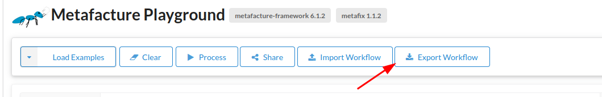

# Lesson 6: Using Metafacture as Command Line Tool

## Get Metafacture Runner as CLI Tool

Hint: This lesson requires basic practical knowledge of the command line and Shell.
If you want to get familiar with tit, have a look at the great intro to Unix Shell by Library Carpentry: https://librarycarpentry.github.io/lc-shell/ (Session 1 - 3) You could also have a look at the great introdution by the Programming Historian to Powershell: https://programminghistorian.org/en/lessons/intro-to-powershell

While we had fun with our Metafacture Playground another way to use Metafacture is
the command line. For running a Metafacture flux process we need a terminal and installed JAVA 11 ore higher.
For creating and editing Flux and Fix files we need an texteditor like Codium/VS Code or others.

For this lesson basic knowledge of the commandline is recommended.

Check if Java 11 or higher is installed with `java -version` in your terminal.
If not, install JAVA 11 or higher.

To use Metafacture on the commandline we can download the latest distribution e.g.: `metafacture-core-7.0.0-dist.zip`:

[https://github.com/metafacture/metafacture-core/releases](https://github.com/metafacture/metafacture-core/releases)

Unzip the downloaded metafacture distribution to your choosen folder

## How to run Metafacture via CLI

You can run your workflows:

Unix:

```bash
./metafacture-core-.../flux.sh path/to/your.flux
```

or Windows:

```bash
./metafacture-core-.../flux.bat path/to/your.flux
```

(Hint: You need to know the path to your file to run the function.)

To get quick started let's revisit a Flux we toyed around with in the playground.
The playground has a nice feature to export and import Metafacture Workflows.

[So lets go to the Playground.](https://metafacture.org/playground/?flux=%22https%3A//openlibrary.org/books/OL2838758M.json%22%0A%7C+open-http%0A%7C+as-lines%0A%7C+decode-json%0A%7C+encode-yaml%0A%7C+print%0A%3B)

Export the workflow with the Export Button and lets run the flux.



Linux:

```bash
./metafacture-core-.../flux.sh  downloads/playground.flux
```

or Windows:

```bash
./metafacture-core-.../flux.bat downloads/playground.flux
```

The result of running the Flux-Script via CLI should be the same as with the Playground.

The Metafacture CLI Tool expects a flux file for every workflow.
Our runned workflow only has the following flux and no additional files since it i querring data from the web and it has no fix transformations.

```default
"https://openlibrary.org/books/OL2838758M.json"
| open-http
| as-lines
| decode-json
| encode-yaml
| print
;
```

## Use local files for transformation

If you want to load a local file instead of fetching data from the web we need to change the flux a little bit with an texteditor.
Download the following file [11942150X.json](/home/tobias/git/metafacture-tutorial/sample-scripts/lesson_06/11942150X.json)
and adjust the path to your file.

Adjust your `downloads/playground.flux` script:

```default
"path/to/your/file/11942150X.json" // Adjust your path!
| open-file
| as-lines
| decode-json
| encode-yaml
| print
;
```

Run it again as shown above.

If we want to use fix we need to refrence the fix file that in the playground we only refrenced via `|fix`

```default
"path/to/your/file/11942150X.json"
| open-file
| as-lines
| decode-json
| fix("path/to/your/fixFile.fix")
| encode-yaml
| print
;
```

Create a new file with a `fixFile.fix`, files with fix scripts should have a `.fix` file suffix.

Add the follwoing line as content:

```PEARL
retain("preferredName","id","type[]")

```

Save it in the same folder as the flux file. (Hint: It does not always have to be in the same folder.)

## Use variables

Hint: You can use the varliable FLUX_DIR to shorten the file path if the file is in the same folder as the flux-file.

```default
FLUX_DIR + "file.json"
| open-file
| as-lines
| decode-json
| fix(FLUX_DIR + "fixFile.fix")
| encode-yaml
| print
;
```

If you are using variables, that are not defined in the flux, you can pass them on with the CLI:

e.g.

```default
FILE
| open-file
| as-lines
| decode-json
| fix(FLUX_DIR + "fixFile.json")
| encode-yaml
| print
;
```

You could use:

```bash
./metafacture-core-.../flux.sh path/to/your.flux FILE="path/to/your/file.json"
```


Excercise: Download the following folder (TODO) with three test examples and run them. Adjust them if needed:

- Run example script locally.
- Adjust example script so that all json files but no other in the folder are read. Get inspired by https://github.com/metafacture/metafacture-core/blob/master/metafacture-runner/src/main/dist/examples/misc/reading-dirs/read-dirs.flux.
- Change the FLUX script so that you write the output in the local file instead of stoudt.
- Add a fix file and add the fix module in the flux. With `nothing()` as content.
- Add some transformations to the fix e.g. add fields.

 Next lesson: [07 Processing MARC](./07_Processing_MARC.md)
