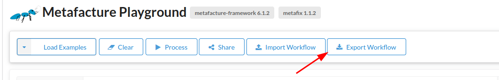

# Lesson 6: Using Metafacture as Command Line Tool

## Get Metafacture Runner as CLI Tool

This lesson requires basic practical knowledge of the command line and Shell.
If you want to get familiar with it, have a look at the great [intro to Unix Shell by Library Carpentry](https://librarycarpentry.github.io/lc-shell/) (Session 1 - 3). You could also have a look at the great [introdution by the Programming Historian to Powershell](https://programminghistorian.org/en/lessons/intro-to-powershell)_

While we had fun with our Metafacture Playground another way to use Metafacture is by
the command line. For running a Metafacture Flux process we need a terminal and Java 11 ore higher.
For creating and editing Flux and Fix files we need a text editor like Codium/VS Code or others.

For this lesson basic knowledge of the commandline is recommended.

Check if Java 11 or higher is installed with `java -version` in your terminal.
If not, install Java 11 or higher.

To use Metafacture on the commandline [download the latest (pre-) release](https://github.com/metafacture/metafacture-core/releases).

Download `metafacture-core-$VERSION-dist.tar.gz` or the zip version and extract the archive to your choosen folder.
In the folder you find the `flux.bat` and `flux.sh`

The code below assumes you moved the resulting folder to your home directory and renamed it to `"metafacture"`.

If you run

Unix:

```bash
~/metafacture/flux.sh
```

or Windows:

```bash
~\metafacture\flux.bat
```

Metafacture will list all currently available Flux Commands.

## How to run Metafacture via CLI

You can run your workflows:

Unix:

```bash
~/metafacture/flux.sh path/to/your.flux
```

or Windows:

```bash
~\metafacture\flux.bat path\to\your.flux
```

(Hint: You need to know the path to your Flux file to run it.)

To get quick started let's revisit a Flux we toyed around with in the playground.
The playground has a nice feature to export and import Metafacture Workflows.

[So lets go to the Playground.](https://metafacture.org/playground/?flux=%22https%3A//openlibrary.org/books/OL2838758M.json%22%0A%7C+open-http%0A%7C+as-lines%0A%7C+decode-json%0A%7C+encode-yaml%0A%7C+print%0A%3B)

Export the workflow with the Export Button:



Open your terminal and and lets run the flux with the following command:

Linux:

```bash
~/metafacture/flux.sh  downloads/playground.flux
```

Windows:

```bash
~\metafacture\flux.bat downloads\playground.flux
```

To simplify the code examples we will be using unix paths for the terminal commands. Windows Powershell will change these to windows paths automatically.

The result of running the Flux script via CLI should be the same as with the Playground.

The Metafacture CLI tool expects a Flux file for every workflow.
Our workflow only has the following Flux and no additional files since it is fetching data from the web and it has no Fix transformations. The file should have the following content, defining the playground specific variables and the Flux workflow that you also saw in the playground. You can delete the playground specific variables since they are not needed so you would end with this:

```text
"https://openlibrary.org/books/OL2838758M.json"
| open-http
| as-lines
| decode-json
| encode-json(prettyPrinting="true")
| print
;
```

## Use local files for transformation

If you want to load a local file instead of fetching data from the web you need to change the Flux a little bit with an text editor.
Download the following file [11942150X.json](./sample-scripts/lesson_06/11942150X.json)
and adjust the path to your file.

Adjust your `downloads/playground.flux` script, so that it does not load data from the web, but opens a local file with `open-file` and reads it using `as-records` since the json file is pretty printed (not as one record per line):

```text
"path/to/your/file/11942150X.json" // Adjust your path!
| open-file
| as-records
| decode-json
| encode-yaml
| print
;
```

Run it again as shown above.

It should output:

```json
{
  "professionOrOccupation" : [ {
    "id" : "https://d-nb.info/gnd/4629643-8",
    "label" : "Politologin"
  }, {
    "id" : "https://d-nb.info/gnd/4025243-7",
    "label" : "Hochschullehrer"
  } ],
  "placeOfBirth" : [ {
    "id" : "https://d-nb.info/gnd/4050042-1",
    "label" : "Riga"
  } ],
  "gender" : [ {
    "id" : "https://d-nb.info/standards/vocab/gnd/gender#female",
    "label" : "Weiblich"
  } ],
  "dateOfDeath" : [ "1992-09-17" ],
  "dateOfBirth" : [ "1928-09-24" ],
  "placeOfDeath" : [ {
    "id" : "https://d-nb.info/gnd/4009352-9",
    "label" : "Cambridge, Mass."
  } ],
  "variantNameEntityForThePerson" : [ {
    "forename" : [ "Judith Nisse" ],
    "surname" : [ "Shklar" ]
  }, {
    "forename" : [ "Judita" ],
    "surname" : [ "Nisse" ]
  }, {
    "forename" : [ "Judith" ],
    "surname" : [ "Shklar" ]
  } ],
  "type" : [ "Person", "AuthorityResource", "DifferentiatedPerson" ],
  "@context" : "https://lobid.org/gnd/context.jsonld",
  "gndSubjectCategory" : [ {
    "id" : "https://d-nb.info/standards/vocab/gnd/gnd-sc#8.1p",
    "label" : "Personen (Politologen, Staatstheoretiker)"
  } ],
  "oldAuthorityNumber" : [ "(DE-588a)11942150X", "(DE-588c)4439975-3", "(DE-588)158461525", "(DE-588a)158461525" ],
  "geographicAreaCode" : [ {
    "id" : "https://d-nb.info/standards/vocab/gnd/geographic-area-code#XD-US",
    "label" : "USA"
  } ],
  "deprecatedUri" : [ "https://d-nb.info/gnd/158461525" ],
  "affiliation" : [ {
    "id" : "https://d-nb.info/gnd/2012974-9",
    "label" : "Harvard University"
  } ],
  "describedBy" : {
    "id" : "https://d-nb.info/gnd/11942150X/about",
    "license" : {
      "id" : "http://creativecommons.org/publicdomain/zero/1.0/",
      "label" : "http://creativecommons.org/publicdomain/zero/1.0/"
    },
    "dateModified" : "2019-07-11T15:58:51.000",
    "descriptionLevel" : {
      "id" : "https://d-nb.info/standards/vocab/gnd/description-level#1",
      "label" : "Allgemeines, Interdisziplinäre Allgemeinwörter"
    }
  },
  "gndIdentifier" : "11942150X",
  "id" : "https://d-nb.info/gnd/11942150X",
  "preferredName" : "Shklar, Judith N.",
  "wikipedia" : [ {
    "id" : "https://de.wikipedia.org/wiki/Judith_N._Shklar",
    "label" : "https://de.wikipedia.org/wiki/Judith_N._Shklar"
  } ],
  "variantName" : [ "Shklar, Judith", "Nisse, Judita", "Shklar, Judith Nisse" ],
  "preferredNameEntityForThePerson" : {
    "forename" : [ "Judith N." ],
    "surname" : [ "Shklar" ]
  },
  "sameAs" : [ {
    "id" : "http://id.loc.gov/rwo/agents/n82231811",
    "collection" : {
      "id" : "http://www.wikidata.org/entity/Q13219454",
      "abbr" : "LC",
      "publisher" : "Library of Congress",
      "icon" : "http://www.loc.gov/favicon.ico",
      "name" : "NACO Authority File"
    }
  }, {
    "id" : "http://viaf.org/viaf/7412367",
    "collection" : {
      "id" : "http://www.wikidata.org/entity/Q54919",
      "abbr" : "VIAF",
      "publisher" : "OCLC",
      "icon" : "http://viaf.org/viaf/images/viaf.ico",
      "name" : "Virtual International Authority File (VIAF)"
    }
  }, {
    "id" : "http://www.wikidata.org/entity/Q455736",
    "collection" : {
      "id" : "http://www.wikidata.org/entity/Q2013",
      "abbr" : "WIKIDATA",
      "publisher" : "Wikimedia Foundation Inc.",
      "icon" : "https://www.wikidata.org/static/favicon/wikidata.ico",
      "name" : "Wikidata"
    }
  }, {
    "collection" : {
      "abbr" : "DNB",
      "name" : "Gemeinsame Normdatei (GND) im Katalog der Deutschen Nationalbibliothek",
      "publisher" : "Deutsche Nationalbibliothek",
      "icon" : "https://www.dnb.de/SiteGlobals/Frontend/DNBWeb/Images/favicon.png?__blob=normal&v=4",
      "id" : "http://www.wikidata.org/entity/Q36578"
    },
    "id" : "https://d-nb.info/gnd/11942150X/about"
  }, {
    "id" : "https://d-nb.info/gnd/158461525",
    "collection" : {
      "id" : "http://www.wikidata.org/entity/Q36578",
      "abbr" : "DNB",
      "publisher" : "Deutsche Nationalbibliothek",
      "icon" : "http://www.dnb.de/SiteGlobals/StyleBundles/Bilder/favicon.png?__blob=normal&v=1",
      "name" : "Gemeinsame Normdatei (GND) im Katalog der Deutschen Nationalbibliothek"
    }
  }, {
    "id" : "https://dbpedia.org/resource/Judith_N._Shklar",
    "collection" : {
      "id" : "https://dbpedia.org"
    }
  }, {
    "collection" : {
      "abbr" : "dewiki",
      "name" : "Wikipedia (Deutsch)",
      "publisher" : "Wikimedia Foundation Inc.",
      "icon" : "https://de.wikipedia.org/static/favicon/wikipedia.ico",
      "id" : "http://www.wikidata.org/entity/Q48183"
    },
    "id" : "https://de.wikipedia.org/wiki/Judith_N._Shklar"
  }, {
    "collection" : {
      "abbr" : "enwiki",
      "name" : "Wikipedia (English)",
      "publisher" : "Wikimedia Foundation Inc.",
      "icon" : "https://en.wikipedia.org/static/favicon/wikipedia.ico",
      "id" : "http://www.wikidata.org/entity/Q328"
    },
    "id" : "https://en.wikipedia.org/wiki/Judith_N._Shklar"
  }, {
    "id" : "https://isni.org/isni/0000000121193284",
    "collection" : {
      "id" : "https://isni.org"
    }
  }, {
    "collection" : {
      "abbr" : "DE-611",
      "name" : "Kalliope Verbundkatalog",
      "publisher" : "Staatsbibliothek zu Berlin - Preußischer Kulturbesitz",
      "icon" : "https://kalliope-verbund.info/img/favicon.ico",
      "id" : "https://kalliope-verbund.info"
    },
    "id" : "https://kalliope-verbund.info/gnd/11942150X"
  }, {
    "collection" : {
      "abbr" : "DDB",
      "name" : "Deutsche Digitale Bibliothek",
      "publisher" : "Deutsche Digitale Bibliothek",
      "icon" : "https://www.deutsche-digitale-bibliothek.de/favicon.ico",
      "id" : "http://www.wikidata.org/entity/Q621630"
    },
    "id" : "https://www.deutsche-digitale-bibliothek.de/person/gnd/11942150X"
  } ]
}
```

If we want to use Fix we need to reference the Fix file (in the playground we only referenced the variable `transformationFile` via `| fix`):

```text
"path/to/your/file/11942150X.json"
| open-file
| as-lines
| decode-json
| fix("path/to/your/fixFile.fix")
| encode-yaml
| print
;
```

Create a new file with the name `fixFile.fix`. Files with Fix scripts should have a `.fix` file suffix to easily discriminate them later.

Add the following line as content to this file:

```perl
retain("preferredName","id","type[]")
```

Save it in the same folder as the Flux file. (Hint: It does not always have to be in the same folder.)

## Use variables

Hint: You can use the varliable FLUX_DIR to shorten the file path if the file is in the same folder as the Flux file:

```text
FLUX_DIR + "file.json"
| open-file
| as-lines
| decode-json
| fix(FLUX_DIR + "fixFile.fix")
| encode-yaml
| print
;
```

If you are using variables that are not defined in the flux, you can pass them on with the CLI:

e.g.

```text
FILE
| open-file
| as-lines
| decode-json
| fix(FLUX_DIR + "fixFile.json")
| encode-yaml
| print
;
```

Which you use like:

```bash
~/metafacture/flux.sh path/to/your.flux FILE="path/to/your/file.json"
```


Excercise: Download the following folder (TODO) with three test examples and run them. Adjust them if needed:

- Run example script locally.
- Adjust example script so that all json files but no other in the folder are read. Get inspired by the [reading directories example](https://github.com/metafacture/metafacture-core/blob/master/metafacture-runner/src/main/dist/examples/misc/reading-dirs/read-dirs.flux).
- Change the Flux script so that you write the output in the local file instead of stoudt.
- Add a Fix file and add the Fix module in the Flux. With `nothing()` as content.
- Add some transformations to the Fix e.g. add fields.

---------------

**Next lesson**: [07 Processing MARC](./07_Processing_MARC.html)
