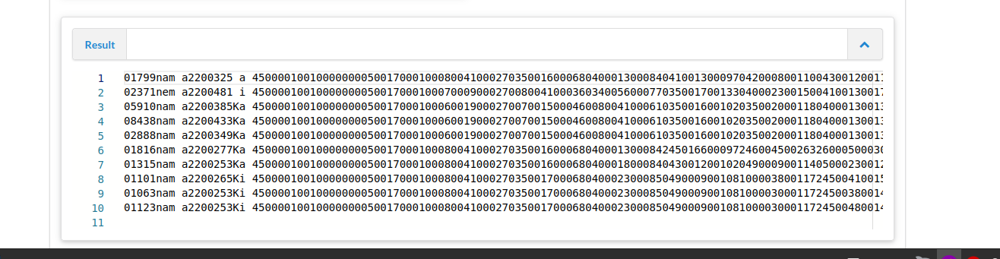
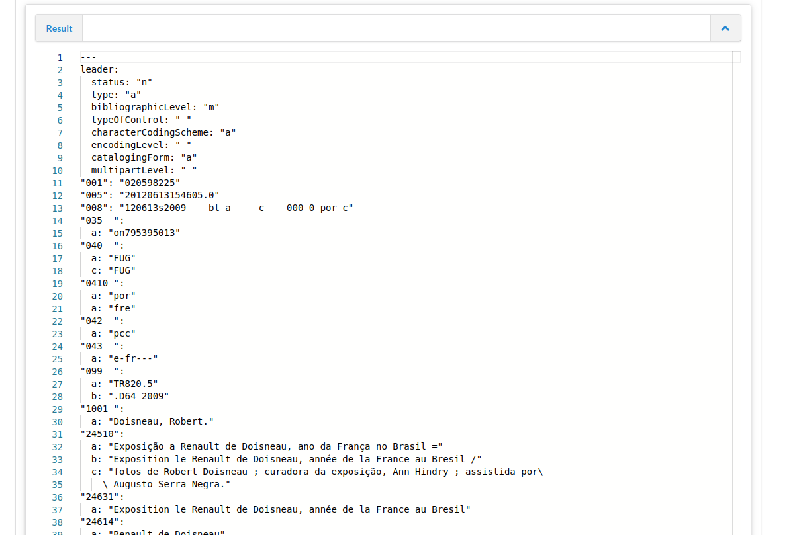

# Lesson 7: Processing MARC with Metafacture

In the previous lessons we learned how we can use Metafacture to process structured data like JSON. In this lesson we will use Metafacture to process MARC metadata records. In this process we will see that MARC can be processed using FIX paths.

[Transformation of MARC data with Metafacture can be used for multiple things, e.g. you could transform MARC binary files to MARC XML.](https://metafacture.org/playground/?flux=%22https%3A//raw.githubusercontent.com/metafacture/metafacture-tutorial/main/data/sample.mrc%22%0A%7C+open-http%0A%7C+as-lines%0A%7C+decode-marc21%28emitleaderaswhole%3D%22true%22%29%0A%7C+encode-marcxml%0A%7C+print%0A%3B)

As always, we will need to set up a small metafacture Flux script.

Lets inspect a MARC file: https://raw.githubusercontent.com/metafacture/metafacture-tutorial/main/data/sample.marc

Create the following Flux in a new file and name it e.g. `marc1.flux`:

```text
"https://raw.githubusercontent.com/metafacture/metafacture-tutorial/main/data/sample.mrc"
| open-http
| as-lines
| print
;
```

Run this Flux via CLI, e.g.:

```bash
/path/to/your/metafix-runner path/to/your/marc1.flux
```

[Or use playground.](https://metafacture.org/playground/?flux=%22https%3A//raw.githubusercontent.com/metafacture/metafacture-tutorial/main/data/sample.mrc%22%0A%7C+open-http%0A%7C+as-lines%0A%7C+print%0A%3B)

You should see something like this:



You also can try to run the examples via CLI.

## Get to know your MARC data

Like JSON the MARC file contains structured data but the format is different. All the data is on one line, but there isn’t at first sight a clear separation between fields and values. The field/value structure is there but you need to use a MARC parser to extract this information. Metafacture has a MARC parser which can be used to interpret this file.

Lets create a new small Flux script to transform the MARC data into YAML, name it `marc2.flux`:

```text
"https://raw.githubusercontent.com/metafacture/metafacture-core/master/metafacture-runner/src/main/dist/examples/read/marc21/10.marc21"
| open-http
| as-lines
| decode-marc21
| encode-yaml
| print
;
```

Run this Flux script with your MF Runner on the CLI.

[Or try it in the the playground.](https://metafacture.org/playground/?flux=%22https%3A//raw.githubusercontent.com/metafacture/metafacture-tutorial/main/data/sample.mrc%22%0A%7C+open-http%0A%7C+as-lines%0A%7C+decode-marc21%0A%7C+encode-yaml%0A%7C+print%0A%3B)

Running it in the playground or with the commandline you will see something like this:



Metafacture has its own decoder for Marc21 data. The structure is translated as the following: The [leader](https://www.loc.gov/marc/bibliographic/bdleader.html) can either be translated in an entity or a single element. All [control fields `00X`](https://www.loc.gov/marc/bibliographic/bd00x.html) are translated into simple string fields with name `00X`.
All `XXX` fields starting with `100` are translated in top elements with name of the field+indice numbers, e.g. element 245 1. Ind 1 and 2. Ind 2 =>  `24512` . Every subfield is translated in a subfield. Additionally keep in mind that repeated elements are transformed into lists.

Let's use `list-fix-paths(count="false")` to show the pathes that are used in the records. It helps to get an overview of the records:

```text
"https://raw.githubusercontent.com/metafacture/metafacture-core/master/metafacture-runner/src/main/dist/examples/read/marc21/10.marc21"
| open-http
| as-lines
| decode-marc21
| list-fix-paths(count="false")
| print
;
```

Lets run it.

[See in the playground.](https://metafacture.org/playground/?flux=%22https%3A//raw.githubusercontent.com/metafacture/metafacture-core/master/metafacture-runner/src/main/dist/examples/read/marc21/10.marc21%22%0A%7C+open-http%0A%7C+as-lines%0A%7C+decode-marc21%0A%7C+list-fix-paths%28count%3D%22false%22%29%0A%7C+print%0A%3B%0A)

## Transform some MARC data

We can use metafacture Fix to read the `_id` fields of the MARC record with the `retain` Fix we learned in the Day 6 post:

Flux:

```text
"https://raw.githubusercontent.com/metafacture/metafacture-tutorial/main/data/sample.mrc"
| open-http
| as-lines
| decode-marc21
| fix("retain('_id')")
| encode-yaml
| print
;
```

You will see:

```yaml
---
_id: "1098313828"

---
_id: "1081168102"

---
_id: "1069434825"

---
_id: "1081636297"

---
_id: "1089079486"

---
_id: "1048482650"

---
_id: "1097290212"

---
_id: "1099987636"

---
_id: "1098451600"

---
_id: "1049752414"


```

[See it in the playground.](https://metafacture.org/playground/?flux=%22https%3A//raw.githubusercontent.com/metafacture/metafacture-tutorial/main/data/sample.mrc%22%0A%7C+open-http%0A%7C+as-lines%0A%7C+decode-marc21%0A%7C+fix%28%22retain%28%27_id%27%29%22%29%0A%7C+encode-yaml%0A%7C+print%0A%3B%0A)

What is happening here? The MARC file `sample.mrc` contains more than one MARC record. For every MARC record Metafacture extracts here the `_id` field. This field is a hidden element in every record and for MARC records it uses the value of the `001` element.

Extracting data out of the MARC record itself is a bit more difficult. This is a little bit different than in Catmandu. As said Metafacture has a specific marc21 decoder. Fields with these indices are translated into fields and every subfield becomes a subfield. What makes it difficult is that some fields are repeatable and some are not. (Catmandu translates the record into an array of arrays while MF does not.)

You need paths of the elements to extract the data. For instance the MARC leader is usually in the first field of a MARC record. Look in the previous posts about paths. To keep the `leader` element we need to retain the element `leader`:

```text
"https://raw.githubusercontent.com/metafacture/metafacture-tutorial/main/data/sample.mrc"
| open-http
| as-lines
| decode-marc21
| fix("retain('leader')")
| encode-yaml
| print
;
```

[See it in the playground.](https://metafacture.org/playground/?flux=%22https%3A//raw.githubusercontent.com/metafacture/metafacture-tutorial/main/data/sample.mrc%22%0A%7C+open-http%0A%7C+as-lines%0A%7C+decode-marc21%0A%7C+fix%28%22retain%28%27leader%27%29%22%29%0A%7C+encode-yaml%0A%7C+print%0A%3B%0A)

```yaml
---
leader:
  status: "n"
  type: "a"
  bibliographicLevel: "m"
  typeOfControl: " "
  characterCodingScheme: "a"
  encodingLevel: " "
  catalogingForm: "c"
  multipartLevel: "a"

---
leader:
  status: "p"
  type: "a"
  bibliographicLevel: "m"
  typeOfControl: " "
  characterCodingScheme: "a"
  encodingLevel: " "
  catalogingForm: "c"
  multipartLevel: "c"

---
leader:
  status: "p"
  type: "a"
  bibliographicLevel: "m"
  typeOfControl: " "
  characterCodingScheme: "a"
  encodingLevel: " "
  catalogingForm: "c"
  multipartLevel: "b"

---
leader:
  status: "p"
  type: "a"
  bibliographicLevel: "m"
  typeOfControl: " "
  characterCodingScheme: "a"
  encodingLevel: " "
  catalogingForm: "c"
  multipartLevel: " "

---
leader:
  status: "n"
  type: "a"
  bibliographicLevel: "m"
  typeOfControl: " "
  characterCodingScheme: "a"
  encodingLevel: " "
  catalogingForm: "c"
  multipartLevel: " "

---
leader:
  status: "n"
  type: "a"
  bibliographicLevel: "m"
  typeOfControl: " "
  characterCodingScheme: "a"
  encodingLevel: " "
  catalogingForm: "c"
  multipartLevel: " "

---
leader:
  status: "n"
  type: "a"
  bibliographicLevel: "s"
  typeOfControl: " "
  characterCodingScheme: "a"
  encodingLevel: " "
  catalogingForm: "c"
  multipartLevel: " "

---
leader:
  status: "n"
  type: "a"
  bibliographicLevel: "m"
  typeOfControl: " "
  characterCodingScheme: "a"
  encodingLevel: " "
  catalogingForm: "c"
  multipartLevel: "b"

---
leader:
  status: "n"
  type: "a"
  bibliographicLevel: "s"
  typeOfControl: " "
  characterCodingScheme: "a"
  encodingLevel: " "
  catalogingForm: "c"
  multipartLevel: " "

---
leader:
  status: "p"
  type: "a"
  bibliographicLevel: "m"
  typeOfControl: " "
  characterCodingScheme: "a"
  encodingLevel: " "
  catalogingForm: "c"
  multipartLevel: " "

```

The leader value is translated into a leader element with the subfields. You also can emit the leader as a whole string if you use `decode-marc21` with a specific option: `| decode-marc21(emitLeaderAsWhole="true")`. [See it here.](https://metafacture.org/playground/?flux=%22https%3A//raw.githubusercontent.com/metafacture/metafacture-tutorial/main/data/sample.mrc%22%0A%7C+open-http%0A%7C+as-lines%0A%7C+decode-marc21%28emitLeaderAsWhole%3D%22true%22%29%60%0A%7C+fix%28%22retain%28%27leader%27%29%22%29%0A%7C+encode-yaml%0A%7C+print%0A%3B%0A)

Transforming  MARC in Metafatcture is more generic than in Catmandu since no MARC specific maps are needed. But some difficulties come with repeatable fields. This is something you usually don’t know. And you have to inspect this first.

Here you see a simple mapping from the element `245 any indicators $a` to a new field named `title`. To map any incicator we use the wildcard `?` for each indicator so the path is: `245??.a`

Flux:

```text
"https://raw.githubusercontent.com/metafacture/metafacture-tutorial/main/data/sample.mrc"
| open-http
| as-lines
| decode-marc21
| fix(transformationFile)
| encode-yaml
| print
;
```

with transformationFile.fix:
```perl
copy_field("245??.a", "title")
retain("title")
```

[See here in the playground.](https://metafacture.org/playground/?flux=%22https%3A//raw.githubusercontent.com/metafacture/metafacture-tutorial/main/data/sample.mrc%22%0A%7C+open-http%0A%7C+as-lines%0A%7C+decode-marc21%0A%7C+fix%28transformationFile%29%0A%7C+encode-yaml%0A%7C+print%0A%3B%0A&transformation=copy_field%28%22245%3F%3F.a%22%2C+%22title%22%29%0Aretain%28%22title%22%29)

More elaborate mappings can be done, too. More complete examples follow in the next posts. As a warming up, here is some code to extract all the record identifiers, titles and isbn numbers of a MARC file into a CSV table (which you can open in Excel).

Step 1: create the Fix file `transformationFile.fix`, containing:

```perl
copy_field("001","id")
add_array("title")
do list(path: "245??.?","var":"$i")
  copy_field("$i","title.$append")
end
join_field(title," ")
add_array("isbn")
do list(path: "020??","var":"$i")
  copy_field("$i.a",isbn.$append)
end
join_field(isbn,",")
retain("id","title","isbn")
```

HINT: Sometimes it makes sense to create an empty array by `add_array` or an empty hash/object by `add_hash` before adding content to the array or hash. This depends on the use-cases. In our case we need empty values if no field is mapped for the CSV.

Step 2: create the Flux workflow and execute this workflow either with CLI or the playground:

```text
"https://raw.githubusercontent.com/metafacture/metafacture-core/master/metafacture-runner/src/main/dist/examples/read/marc21/10.marc21"
| open-http
| as-lines
| decode-marc21
| fix("transformationFile.fix")
| encode-csv
| print
;

```

[See it in the Playground here.](https://metafacture.org/playground/?flux=%22https%3A//raw.githubusercontent.com/metafacture/metafacture-tutorial/main/data/sample.mrc%22%0A%7C+open-http%0A%7C+as-lines%0A%7C+decode-marc21%0A%7C+fix%28transformationFile%29%0A%7C+encode-csv%28includeheader%3D%22true%22%29%0A%7C+print%0A%3B%0A%0A&transformation=copy_field%28%22001%22%2C%22id%22%29%0Aadd_array%28%22title%22%29%0Ado+list%28path%3A+%22245%3F%3F.%3F%22%2C%22var%22%3A%22%24i%22%29%0A++copy_field%28%22%24i%22%2C%22title.%24append%22%29%0Aend%0Ajoin_field%28title%2C%22+%22%29%0Aadd_array%28%22isbn%22%29%0Ado+list%28path%3A+%22020%3F%3F.a%22%2C%22var%22%3A%22%24i%22%29%0A++copy_field%28%22%24i%22%2Cisbn.%24append%29%0Aend%0Ajoin_field%28isbn%2C%22%2C%22%29%0Aretain%28%22id%22%2C%22title%22%2C%22isbn%22%29)


You will see this as output:

```CSV
"id","title","isbn"
"110028351X","Prüfungsvorbereitung für das Fachabitur Original-Prüfungsaufgaben inklusive Lösungen und ausführlichen Erklärungen [...] BWR ... FOS, BOS 12 Bayern",""
"1099986818","Schwerpunktheft Fachkräfte für Deutschland Zwischenbilanz und Fortschreibung Herausgeberin Bundesagentur für Arbeit",""
"1052354327","Exkursionsflora für Istrien von Walter K. Rottensteiner (Hrsg.)","9783853280676"
"107083095X","Waldbus und Limesbus ... Touren und Ausflugs-Tipps im Schwäbischen Wald : kostenlose Fahrradmitnahme Herausgeber: VVS GmbH in Zusammenarbeit mit dem Landratsamt Rems-Murr-Kreis und der Fremdenverkehrsgemeinschaft Schwäbischer Wald",""
"1099120101","Wirtschaftsstandort Landkreis Cloppenburg",""
"1003858902","Veröffentlichung des Museumsverbundes im Landkreis Celle",""
"1073620735","˜Dasœ Höchster Porzellan-Museum im Kronberger Haus Dépendance des Historischen Museums Frankfurt Patricia Stahl","3892820457"
"1098164636","Arbeit in Aufsichts- und Verwaltungsräten in kommunalen Unternehmen und Einrichtungen in Nordrhein-Westfalen von Porf.Dr. Frank Bätge ; Sozialdemokratischen Gemeinschaft für Kommunalpolitik in NRW e.V.","9783937541297"
"1081732687","Numerische Verschleißberechnung für Schmiedewerkzeuge unter Berücksichtigung lokaler Härteveränderungen bei zyklisch-thermischer Beanspruchung Andreas Klassen","9783959000598,3959000596"
"1080278184","Renfro Valley Kentucky Rainer H. Schmeissner",""
```

In the Fix above we mapped the field 245 to the title, and iterated over every subfield with the help of the list-bind and the `?`- wildcard. The ISBN is in the 020-field. Because MARC records can contain one or more 020 fields we created an isbn array with add_array and added the values using the isbn.$append syntax. Next we turned the isbn array back into a comma separated string using the join_field fix. As last step we deleted all the fields we didn’t need in the output with the `retain` syntax.

Different versions of MARC-Serialization need different workflows: e.g. [here see an example of Aseq-MARC Files that are transformed to MARCxml.](https://test.metafacture.org/playground/?flux=%22https%3A//raw.githubusercontent.com/LibreCat/Catmandu-MARC/dev/t/rug01.aleph%22%0A%7C+open-http%0A%7C+as-lines%0A%7C+decode-aseq%0A%7C+merge-same-ids%0A%7C+encode-marcxml%0A%7C+print%0A%3B)

In this post we demonstrated how to process MARC data. In the next post we will show some examples how Catmandu typically can be used to process library data.

## Excercise

Try to fetch some data from GND or an other MARC XML resource and use the Flux command `list-fix-paths` on them, e.g.: https://d-nb.info/1351874063/about/marcxml.

- [In context of changes in cataloguing rules to RDA the element 260 is not used anymore, `move_field` the content of 260 to 264.](https://metafacture.org/playground/?flux=inputFile%0A%7C+open-file%0A%7C+decode-xml%0A%7C+handle-marcxml%0A%7C+fix%28transformationFile%29%0A%7C+encode-marcxml%0A%7C+print%0A%3B&transformation=&data=%3C%3Fxml+version%3D%221.0%22+encoding%3D%22UTF-8%22%3F%3E%0A++%3Crecord+xmlns%3D%22http%3A//www.loc.gov/MARC21/slim%22+type%3D%22Bibliographic%22%3E%0A++++%3Cleader%3E00000nam+a2200000uc+4500%3C/leader%3E%0A++++%3Ccontrolfield+tag%3D%22001%22%3E1191316114%3C/controlfield%3E%0A++++%3Ccontrolfield+tag%3D%22003%22%3EDE-101%3C/controlfield%3E%0A++++%3Ccontrolfield+tag%3D%22005%22%3E20210617171509.0%3C/controlfield%3E%0A++++%3Ccontrolfield+tag%3D%22007%22%3Ecr%7C%7C%7C%7C%7C%7C%7C%7C%7C%7C%7C%7C%3C/controlfield%3E%0A++++%3Ccontrolfield+tag%3D%22008%22%3E190724s2010++++gw+%7C%7C%7C%7C%7Co%7C%7C%7C%7C+00%7C%7C%7C%7Ceng++%3C/controlfield%3E%0A++++%3Cdatafield+tag%3D%22041%22+ind1%3D%22+%22+ind2%3D%22+%22%3E%0A++++++%3Csubfield+code%3D%22a%22%3Eeng%3C/subfield%3E%0A++++%3C/datafield%3E%0A++++%3Cdatafield+tag%3D%22100%22+ind1%3D%221%22+ind2%3D%22+%22%3E%0A++++++%3Csubfield+code%3D%220%22%3Ehttps%3A//d-nb.info/gnd/142627097%3C/subfield%3E%0A++++++%3Csubfield+code%3D%22a%22%3EBorgman%2C+Christine+L.%3C/subfield%3E%0A++++++%3Csubfield+code%3D%224%22%3Eaut%3C/subfield%3E%0A++++++%3Csubfield+code%3D%222%22%3Egnd%3C/subfield%3E%0A++++%3C/datafield%3E%0A++++%3Cdatafield+tag%3D%22245%22+ind1%3D%221%22+ind2%3D%220%22%3E%0A++++++%3Csubfield+code%3D%22a%22%3EResearch+Data%3A+who+will+share+what%2C+with+whom%2C+when%2C+and+why%3F%3C/subfield%3E%0A++++%3C/datafield%3E%0A++++%3Cdatafield+tag%3D%22260%22+ind1%3D%22+%22+ind2%3D%22+%22%3E%0A++++++%3Csubfield+code%3D%22a%22%3EBerlin%3C/subfield%3E%0A++++++%3Csubfield+code%3D%22c%22%3E2010%3C/subfield%3E%0A++++%3C/datafield%3E%0A++++%3Cdatafield+tag%3D%22300%22+ind1%3D%22+%22+ind2%3D%22+%22%3E%0A++++++%3Csubfield+code%3D%22a%22%3EOnline-Ressource%2C+21+S.%3C/subfield%3E%0A++++%3C/datafield%3E%0A++%3C/record%3E%0A)

- [In a publisher's provided metadata `264  .c` has a prefix `c` for copyright, this is unnecessary. Delete the c e.g. by using `replace_all`.](https://metafacture.org/playground/?flux=inputFile%0A%7C+open-file%0A%7C+decode-xml%0A%7C+handle-marcxml%0A%7C+fix%28transformationFile%29%0A%7C+encode-marcxml%0A%7C+print%0A%3B&transformation=%23+ersetze+im+Feld+264+c+das+%22c%22+durch+nichts+%22%22%0A%23+Hilfestellung+Pfad+zum+Unterfeld%3A++%22264++.c%22%0A&data=%3C%3Fxml+version%3D%221.0%22+encoding%3D%22UTF-8%22%3F%3E%0A++%3Crecord+xmlns%3D%22http%3A//www.loc.gov/MARC21/slim%22+type%3D%22Bibliographic%22%3E%0A++++%3Cleader%3E00000nam+a2200000uc+4500%3C/leader%3E%0A++++%3Ccontrolfield+tag%3D%22001%22%3E1191316114%3C/controlfield%3E%0A++++%3Ccontrolfield+tag%3D%22003%22%3EDE-101%3C/controlfield%3E%0A++++%3Ccontrolfield+tag%3D%22005%22%3E20210617171509.0%3C/controlfield%3E%0A++++%3Ccontrolfield+tag%3D%22007%22%3Ecr%7C%7C%7C%7C%7C%7C%7C%7C%7C%7C%7C%7C%3C/controlfield%3E%0A++++%3Ccontrolfield+tag%3D%22008%22%3E190724s2010++++gw+%7C%7C%7C%7C%7Co%7C%7C%7C%7C+00%7C%7C%7C%7Ceng++%3C/controlfield%3E%0A++++%3Cdatafield+tag%3D%22041%22+ind1%3D%22+%22+ind2%3D%22+%22%3E%0A++++++%3Csubfield+code%3D%22a%22%3Eeng%3C/subfield%3E%0A++++%3C/datafield%3E%0A++++%3Cdatafield+tag%3D%22100%22+ind1%3D%221%22+ind2%3D%22+%22%3E%0A++++++%3Csubfield+code%3D%220%22%3Ehttps%3A//d-nb.info/gnd/142627097%3C/subfield%3E%0A++++++%3Csubfield+code%3D%22a%22%3EBorgman%2C+Christine+L.%3C/subfield%3E%0A++++++%3Csubfield+code%3D%224%22%3Eaut%3C/subfield%3E%0A++++++%3Csubfield+code%3D%222%22%3Egnd%3C/subfield%3E%0A++++%3C/datafield%3E%0A++++%3Cdatafield+tag%3D%22245%22+ind1%3D%221%22+ind2%3D%220%22%3E%0A++++++%3Csubfield+code%3D%22a%22%3EResearch+Data%3A+who+will+share+what%2C+with+whom%2C+when%2C+and+why%3F%3C/subfield%3E%0A++++%3C/datafield%3E%0A++++%3Cdatafield+tag%3D%22264%22+ind1%3D%22+%22+ind2%3D%22+%22%3E%0A++++++%3Csubfield+code%3D%22a%22%3EBerlin%3C/subfield%3E%0A++++++%3Csubfield+code%3D%22c%22%3Ec2010%3C/subfield%3E%0A++++%3C/datafield%3E%0A++++%3Cdatafield+tag%3D%22300%22+ind1%3D%22+%22+ind2%3D%22+%22%3E%0A++++++%3Csubfield+code%3D%22a%22%3EOnline-Ressource%2C+21+S.%3C/subfield%3E%0A++++%3C/datafield%3E%0A++%3C/record%3E%0A)

- [Fetch all ISBNs from field 020 and write them in an JSON array element callend `isbn\[\]` and only retain this element.](https://metafacture.org/playground/?flux=inputFile%0A%7Copen-file%0A%7Cdecode-xml%0A%7Chandle-marcxml%0A%7Cfix%28transformationFile%29%0A%7Cencode-json%28prettyPrinting%3D%22true%22%29%0A%7Cprint%0A%3B&transformation=&data=%3C%3Fxml+version%3D%221.0%22+encoding%3D%22UTF-8%22%3F%3E%0A++%3Crecord+xmlns%3D%22http%3A//www.loc.gov/MARC21/slim%22+type%3D%22Bibliographic%22%3E%0A++++%3Cleader%3E00000nam+a2200000+c+4500%3C/leader%3E%0A++++%3Ccontrolfield+tag%3D%22008%22%3E190712%7C2020%23%23%23%23xxu%23%23%23%23%23%23%23%23%23%23%23%7C%7C%7C%23%7C%23eng%23c%3C/controlfield%3E%0A++++%3Ccontrolfield+tag%3D%22001%22%3E990363239750206441%3C/controlfield%3E%0A++++%3Cdatafield+tag%3D%22020%22+ind1%3D%22+%22+ind2%3D%22+%22%3E%3Csubfield+code%3D%22a%22%3E9781138393295%3C/subfield%3E%3Csubfield+code%3D%22c%22%3Epaperback%3C/subfield%3E%3C/datafield%3E%0A++++%3Cdatafield+tag%3D%22020%22+ind1%3D%22+%22+ind2%3D%22+%22%3E%3Csubfield+code%3D%22a%22%3E9780367260934%3C/subfield%3E%3Csubfield+code%3D%22c%22%3Ehardback%3C/subfield%3E%3Csubfield+code%3D%229%22%3E978036726093-4%3C/subfield%3E%3C/datafield%3E%0A++++%3Cdatafield+tag%3D%22041%22+ind1%3D%22+%22+ind2%3D%22+%22%3E%3Csubfield+code%3D%22a%22%3Eeng%3C/subfield%3E%3C/datafield%3E%0A++++%3Cdatafield+tag%3D%22100%22+ind1%3D%221%22+ind2%3D%22+%22%3E%3Csubfield+code%3D%22a%22%3EMatloff%2C+Norman+S.%3C/subfield%3E%3Csubfield+code%3D%22d%22%3E1948-%3C/subfield%3E%3Csubfield+code%3D%220%22%3E%28DE-588%291018956115%3C/subfield%3E%3Csubfield+code%3D%224%22%3Eaut%3C/subfield%3E%3Csubfield+code%3D%220%22%3Ehttps%3A//d-nb.info/gnd/1018956115%3C/subfield%3E%3Csubfield+code%3D%220%22%3Ehttp%3A//viaf.org/viaf/65542823%3C/subfield%3E%3Csubfield+code%3D%22B%22%3EGND-1018956115%3C/subfield%3E%3C/datafield%3E%0A++++%3Cdatafield+tag%3D%22245%22+ind1%3D%221%22+ind2%3D%220%22%3E%3Csubfield+code%3D%22a%22%3EProbability+and+statistics+for+data+science%3C/subfield%3E%3Csubfield+code%3D%22b%22%3EMath+%2B+R+%2B+Data%3C/subfield%3E%3Csubfield+code%3D%22c%22%3ENorman+Matloff%3C/subfield%3E%3C/datafield%3E%0A++++%3Cdatafield+tag%3D%22264%22+ind1%3D%22+%22+ind2%3D%221%22%3E%3Csubfield+code%3D%22a%22%3EBoca+Raton+%3B+London+%3B+New+York%3C/subfield%3E%3Csubfield+code%3D%22b%22%3ECRC+Press%3C/subfield%3E%3Csubfield+code%3D%22c%22%3E%5B2020%5D%3C/subfield%3E%3C/datafield%3E%0A++++%3Cdatafield+tag%3D%22300%22+ind1%3D%22+%22+ind2%3D%22+%22%3E%3Csubfield+code%3D%22a%22%3Exxxii%2C+412+Seiten%3C/subfield%3E%3Csubfield+code%3D%22b%22%3EDiagramme%3C/subfield%3E%3Csubfield+code%3D%22c%22%3E24+cm%3C/subfield%3E%3C/datafield%3E%0A++%3C/record%3E)

- [Create a list with all identifiers in `001` without element names or occurence. You could use the flux command `list-fix-values` with the option `count="false"`.](https://metafacture.org/playground/?flux=%22https%3A//raw.githubusercontent.com/metafacture/metafacture-core/master/metafacture-runner/src/main/dist/examples/read/marc21/10.marc21%22%0A%7C+open-http%0A%7C+as-lines%0A%7C+decode-marc21%0A%7C+...%0A%7C+print%0A%3B)

- TODO: Add an example for a list bind or an conditional.

---------------

**Next lesson**: [08 Harvest data with OAI-PMH](./08_Harvest_data_with_OAI-PMH.html)
