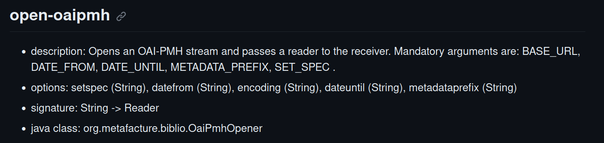

# Lesson 8: Harvest data with OAI-PMH

The Open Archives Initiative Protocol for Metadata Harvesting (OAI-PMH) is a protocol to harvest metadata records from OAI compliant repositories. It was developed by the Open Archives Initiative as a low-barrier mechanism for repository interoperability. The Open Archives Initiative maintains a registry of OAI data providers.

Metafacture provides a Flux module for harvesting metadata from OAI-PMH: `open-oaipmh`.

Lets have a look at the documentation of open-oaipmh:



You see the specific options that can be used to configure your OAI PMH harvesting.

Every OAI server must provide metadata records in Dublin Core, other (bibliographic) formats like MARC may be supported additionally. Available metadata formats can be detected with the OAI verb `ListMetadataFormats`, [see an example](https://lib.ugent.be/oai?verb=ListMetadataFormats) which provides MODS and Dublin Core. For specifying the metadata format use the `metadataprefix` option.

The OAI server may support selective harvesting, so OAI clients can get only subsets of records from a repository.
The client requests could be limited via datestamps (`datefrom`, `dateuntil`) or by setting the membership (`setSpec`).

To get some Dublin Core records from the collection of Ghent University Library and convert it to JSON (default) run the following Metafacture workflow via Playground or CLI:

```text
"https://lib.ugent.be/oai"
| open-oaipmh(metadataPrefix="oai_dc", setSpec="flandrica")
| decode-xml
| handle-generic-xml
| encode-json(prettyPrinting="true")
| print
;
```

If you just want to use the specific metadata records and not the OAI-PMH specific metadata wrappers then specify the XML handler like this: `| handle-generic-xml(recordtagname="dc")`

You can also harvest MARC data, serialize it to MARC-binary and store it in a file:

```text
"https://lib.ugent.be/oai"
| open-oaipmh(metadataPrefix="marcxml", setSpec="flandrica")
| decode-xml
| handle-marcxml
| encode-marc21
| write("ugent.mrc")
;
```

You can also transform incoming data and store/index it with MongoDB or Elasticsearch. For the transformation you need to create a fix (see Lesson 3) in the playground or in a text editor:

Add the following fixes to the file:

```perl
copy_field("001","_id")
copy_field("245??.a","title")
copy_field("100??.a","creator[].$append")
copy_field("260??.c","date")
retain("_id","title","creator[]","date")
```

Now you can run an ETL process (extract, transform, load) with this worklflow:

```text
"https://lib.ugent.be/oai"
| open-oaipmh(metadataPrefix="marcxml", setSpec="flandrica")
| decode-xml
| handle-marcxml
| fix(transformationFile)
| encode-json
| json-to-elasticsearch-bulk(idkey="_id", type="resource", index="resources-alma-fix-staging")
| print
;
```

Excercise: Try to fetch data from an OAI-PMH you know. (e.g. the [DNB OAI](https://www.dnb.de/DE/Professionell/Metadatendienste/Datenbezug/OAI/oai_node.html))

---------------

**Next lesson**: [09 Working with CSV and TSV](./09_Working_with_CSV.html)
